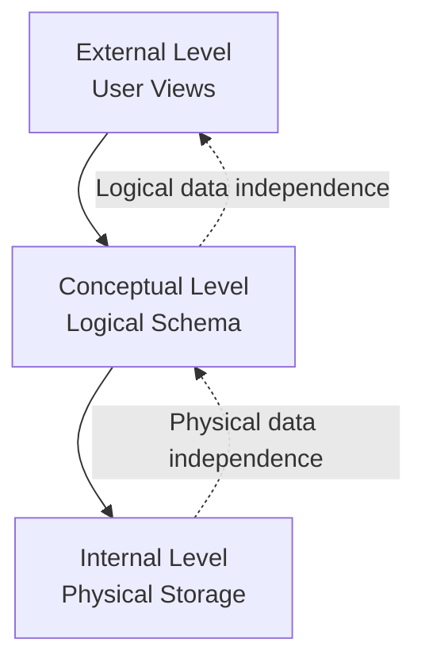
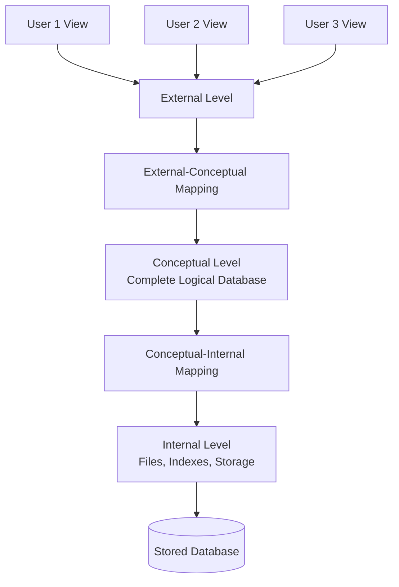
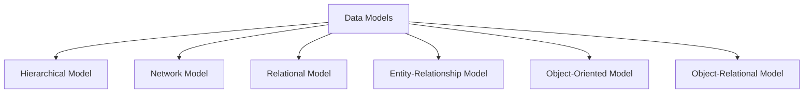
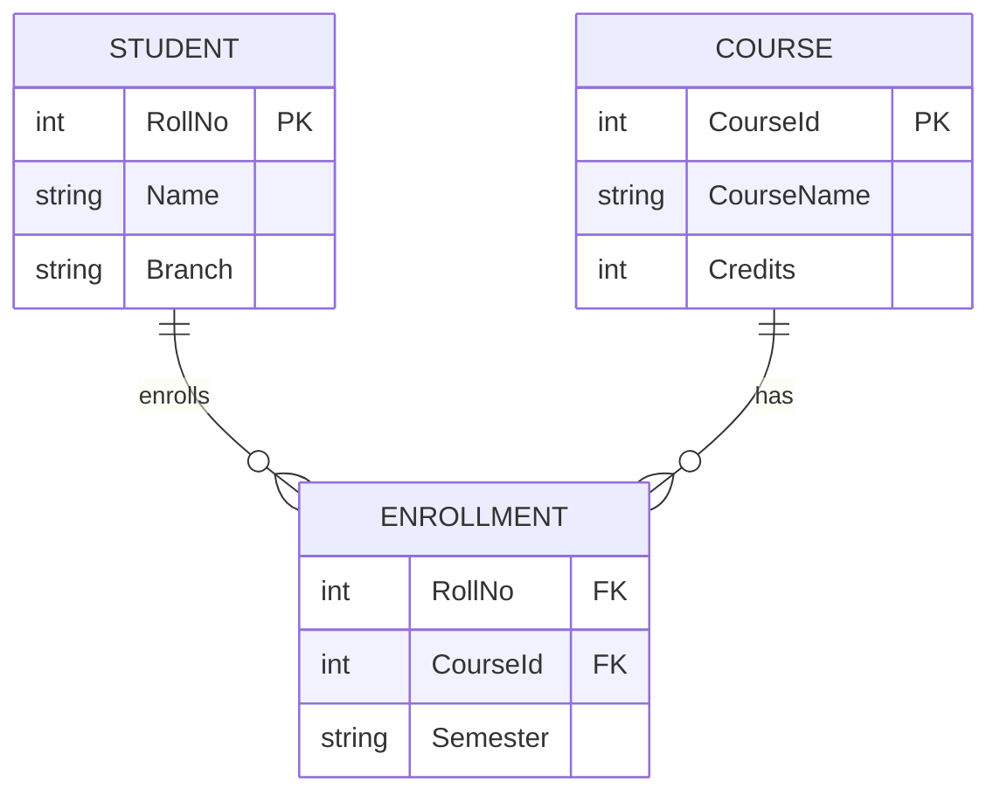
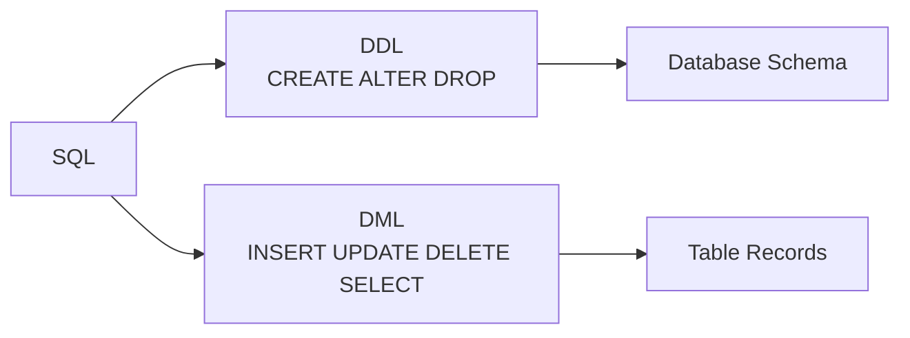

# Unit I - Introduction to DBMS and Data Models

## Important Questions

| # | Question | Years Asked | Frequency |
|---|---|---|---|
| 1 | Data Independence - Define / Discuss data independence and its types | 2025, 2023 Apr, 2022 | 3 times |
| 2 | DBMS Architecture - Explain ANSI/SPARC 3-level architecture of DBMS | 2023 Nov, 2021 Nov, 2021 Apr | 3 times |
| 3 | Types of Data Models - Explain different types of data models with examples | 2024, 2023 Nov, 2021 Nov, 2021 Apr | 4 times |
| 4 | E-R Model - Discuss Entity-Relationship model with examples | 2025, 2023 Apr, 2023 Nov | 3 times |
| 5 | DDL and DML - Write short notes on DDL and DML | 2025, 2022 | 2 times |

---

## 1. Data Independence

### Exam Answer

Data independence is the ability to modify the schema at one level of a database system without changing the schema at the next higher level. It is one of the main benefits of DBMS because it separates user applications from physical storage and logical design details.

In a DBMS, data is viewed at different levels: internal, conceptual, and external. If changes at lower levels do not force changes in programs or user views, the system is called data independent.

### Types of Data Independence

| Type | Meaning | Example | Difficulty |
|---|---|---|---|
| Physical data independence | Change in physical storage without changing conceptual schema | Changing file organization, adding index, changing storage location | Easier |
| Logical data independence | Change in conceptual schema without changing external views or applications | Adding new attribute, splitting a table, adding relationship | Harder |

### Physical Data Independence

Physical data independence means changes in internal storage should not affect the logical structure of the database.

Examples:

- Changing from heap file to indexed file.
- Adding B+ tree index on RollNo.
- Moving data from one disk to another.
- Changing record placement or compression technique.

### Logical Data Independence

Logical data independence means changes in the conceptual schema should not affect external views or application programs.

Examples:

- Adding a new column Email to Student table.
- Splitting Student into StudentPersonal and StudentAcademic.
- Creating views so old programs still work.

### Diagram



### Advantages

- Reduces maintenance cost.
- Applications become less dependent on storage details.
- Allows performance tuning without changing user programs.
- Supports database evolution over time.

### Conclusion

Data independence makes DBMS flexible and reliable. Physical data independence is easier to achieve, while logical data independence is more difficult because application views depend on logical structure.

---

## 2. ANSI/SPARC Three-Level Architecture of DBMS

### Exam Answer

The ANSI/SPARC architecture is a standard three-level architecture of DBMS. It separates the database system into external, conceptual, and internal levels. The main purpose of this architecture is data abstraction and data independence.

### Diagram



### Levels

| Level | Meaning | Example |
|---|---|---|
| External level | User-specific view of data | Student sees marks, admin sees fee details |
| Conceptual level | Complete logical structure of database | Tables, attributes, relationships, constraints |
| Internal level | Physical storage structure | Files, indexes, blocks, access paths |

### External Level

This is the highest level. It describes how different users view the database. A user does not need to see the entire database.

Example: A teacher may see StudentName, RollNo, Marks, while the accounts department may see RollNo and FeeStatus.

### Conceptual Level

This level describes the complete logical database. It includes entities, attributes, relationships, constraints, and tables. It hides physical storage details.

Example: Student(RollNo, Name, Branch), Course(CourseId, CourseName), Enrolls relationship.

### Internal Level

This is the lowest level. It describes how data is physically stored in memory or disk.

Example: indexes, file organization, blocks, record placement, hashing.

### Mappings

- External-conceptual mapping connects user views with logical schema.
- Conceptual-internal mapping connects logical schema with physical storage.

### Advantages

- Provides data abstraction.
- Supports physical and logical data independence.
- Improves security by giving different views to different users.
- Makes database maintenance easier.

### Conclusion

ANSI/SPARC architecture is important because it separates user view, logical design, and physical storage. This separation is the foundation of data independence in DBMS.

---

## 3. Types of Data Models

### Exam Answer

A data model is a collection of concepts used to describe the structure of a database. It defines how data is stored, connected, processed, and constrained. Data models help database designers represent real-world information in a systematic form.

### Main Types



### 1. Hierarchical Data Model

Data is arranged in a tree structure. Each child has only one parent.

Example: University -> Department -> Student.

Advantages:

- Simple parent-child representation.
- Fast access for hierarchical data.

Limitations:

- Many-to-many relationships are difficult.
- Structure is rigid.

### 2. Network Data Model

Data is represented as records connected by links. A child can have multiple parents, so many-to-many relationships can be represented.

Example: Student can enroll in many Courses, and each Course can have many Students.

Advantages:

- More flexible than hierarchical model.
- Supports complex relationships.

Limitations:

- Complex structure.
- Difficult for normal users.

### 3. Relational Data Model

Data is stored in tables called relations. Rows are tuples and columns are attributes.

Example:

| RollNo | Name | Branch |
|---|---|---|
| 1 | Aman | CSE |
| 2 | Riya | IT |

Advantages:

- Simple tabular format.
- Uses SQL.
- Strong mathematical foundation.
- Supports keys and constraints.

### 4. Entity-Relationship Model

The E-R model represents real-world objects as entities and associations as relationships. It is mainly used for database design.

Example: Student enrolls in Course.

### 5. Object-Oriented Data Model

Data is stored as objects, like in object-oriented programming. Objects contain data and methods.

Example: Student object has RollNo, Name, Branch and methods like calculateGrade().

Useful for complex applications such as CAD, multimedia, and engineering databases.

### 6. Object-Relational Data Model

It combines relational model with object-oriented features.

Example: PostgreSQL supports user-defined types and complex data types.

### Comparison

| Model | Structure | Best Use |
|---|---|---|
| Hierarchical | Tree | Organization chart, file systems |
| Network | Graph | Complex many-to-many data |
| Relational | Tables | Business applications |
| E-R | Entities and relationships | Database design |
| Object-oriented | Objects | Complex objects and multimedia |
| Object-relational | Tables plus objects | Modern enterprise systems |

### Conclusion

Different data models represent data in different ways. The relational model is most widely used because it is simple, powerful, and supported by SQL.

---

## 4. Entity-Relationship Model

### Exam Answer

The Entity-Relationship model is a high-level conceptual data model used to represent real-world objects and their relationships. It is mainly used during database design before converting the design into relational tables.

### Main Concepts

| Concept | Meaning | Example |
|---|---|---|
| Entity | Real-world object | Student, Course, Teacher |
| Entity set | Collection of similar entities | All students |
| Attribute | Property of entity | RollNo, Name, Address |
| Relationship | Association between entities | Student enrolls in Course |
| Key attribute | Uniquely identifies entity | RollNo |
| Weak entity | Entity dependent on another entity | Dependent of Employee |

### Types of Attributes

- Simple attribute: cannot be divided, e.g. Age.
- Composite attribute: can be divided, e.g. Name into FirstName and LastName.
- Single-valued attribute: one value, e.g. RollNo.
- Multi-valued attribute: multiple values, e.g. PhoneNo.
- Derived attribute: calculated value, e.g. Age from DateOfBirth.

### Relationship Cardinality

| Type | Meaning | Example |
|---|---|---|
| One-to-one | One entity relates to one entity | Person has Passport |
| One-to-many | One entity relates to many entities | Department has Students |
| Many-to-many | Many entities relate to many entities | Student enrolls in Courses |

### E-R Diagram Example



### Advantages

- Easy to understand.
- Helps in database design.
- Represents entities, attributes, and relationships clearly.
- Can be converted into relational schema.

### Limitations

- Does not show detailed operations.
- Large E-R diagrams can become complex.

### Conclusion

The E-R model is a powerful design tool in DBMS. It gives a clear conceptual view of data before actual implementation in tables.

---

## 5. DDL and DML

### Exam Answer

SQL commands are divided into different categories. DDL and DML are two important categories used for defining and manipulating database data.

### DDL - Data Definition Language

DDL is used to define or modify the structure of database objects such as tables, views, indexes, and schemas.

Common DDL commands:

| Command | Use |
|---|---|
| CREATE | Creates database object |
| ALTER | Modifies structure |
| DROP | Deletes object permanently |
| TRUNCATE | Removes all records from table |
| RENAME | Renames object |

Example:

```sql
CREATE TABLE Student (
  RollNo INT PRIMARY KEY,
  Name VARCHAR(50),
  Branch VARCHAR(20)
);

ALTER TABLE Student ADD Email VARCHAR(100);
```

### DML - Data Manipulation Language

DML is used to insert, update, delete, and retrieve data from tables.

Common DML commands:

| Command | Use |
|---|---|
| INSERT | Adds new rows |
| UPDATE | Modifies existing rows |
| DELETE | Removes selected rows |
| SELECT | Retrieves data |

Example:

```sql
INSERT INTO Student VALUES (1, 'Aman', 'CSE', 'aman@example.com');
UPDATE Student SET Branch = 'IT' WHERE RollNo = 1;
SELECT * FROM Student;
DELETE FROM Student WHERE RollNo = 1;
```

### Difference Between DDL and DML

| Basis | DDL | DML |
|---|---|---|
| Full form | Data Definition Language | Data Manipulation Language |
| Purpose | Defines structure | Manipulates data |
| Commands | CREATE, ALTER, DROP | INSERT, UPDATE, DELETE, SELECT |
| Effect | Affects schema | Affects records |
| Rollback | Often auto-committed in many DBMS | Can be rolled back before commit |

### Diagram



### Conclusion

DDL deals with the structure of the database, while DML deals with the actual data stored in the database. Both are essential parts of SQL.

