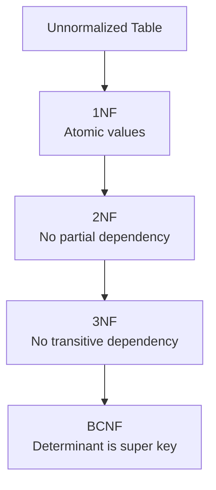

# Unit II - Relational Model and Query Languages

## 1. Relational Algebra Operations

Relational algebra is a procedural query language. It tells what data is required and how to obtain it. It takes one or more relations as input and produces a relation as output.

### Basic Operations

| Operation | Symbol | Meaning | Example |
|---|---|---|---|
| Selection | sigma | Selects rows | sigma Branch='CSE'(Student) |
| Projection | pi | Selects columns | pi Name,Branch(Student) |
| Union | U | Combines tuples | CSE U IT |
| Difference | - | Tuples in one relation but not other | A - B |
| Cartesian product | x | Combines every row pair | Student x Course |
| Rename | rho | Renames relation/attribute | rho S(Student) |

### Derived Operations

- Intersection: common tuples between two relations.
- Join: combines related tuples from two relations.
- Division: used for "for all" type queries.

### Diagram


### Example

If Student(RollNo, Name, Branch) is given:

```text
sigma Branch='CSE'(Student)
```

This returns all students whose branch is CSE.

### Conclusion

Relational algebra is important because SQL queries are internally converted into relational algebra expressions for processing and optimization.

---

## 2. Normalization

Normalization is the process of organizing data in a database to reduce redundancy and remove anomalies. It divides large tables into smaller related tables.

### Need for Normalization

- Reduces duplicate data.
- Avoids insertion anomaly.
- Avoids update anomaly.
- Avoids deletion anomaly.
- Improves consistency.

### Normal Forms

| Normal Form | Rule |
|---|---|
| 1NF | Attributes must contain atomic values; no repeating groups |
| 2NF | In 1NF and no partial dependency on part of composite key |
| 3NF | In 2NF and no transitive dependency |
| BCNF | For every FD X -> Y, X must be a super key |

### Example

Unnormalized table:

| RollNo | StudentName | Course1 | Course2 |
|---|---|---|---|
| 1 | Aman | DBMS | OS |

Problem: repeating course columns.

After 1NF:

| RollNo | StudentName | Course |
|---|---|---|
| 1 | Aman | DBMS |
| 1 | Aman | OS |

### Diagram



### Conclusion

Normalization improves database design by minimizing redundancy and anomalies. For most exam answers, explain 1NF, 2NF, 3NF, and BCNF with a small example.

---

## 3. Functional Dependencies and Armstrong's Axioms

A functional dependency X -> Y means attribute set X uniquely determines attribute set Y. If two tuples have the same value of X, they must have the same value of Y.

Example: RollNo -> StudentName.

### Types

| Type | Meaning | Example |
|---|---|---|
| Trivial FD | Y is subset of X | RollNo,Name -> Name |
| Non-trivial FD | Y is not subset of X | RollNo -> Name |
| Full FD | Y depends on complete composite key | RollNo,CourseId -> Marks |
| Partial FD | Y depends on part of composite key | RollNo,CourseId -> StudentName |
| Transitive FD | X -> Y and Y -> Z | RollNo -> DeptId, DeptId -> DeptName |

### Armstrong's Axioms

| Rule | Meaning |
|---|---|
| Reflexivity | If Y is subset of X, then X -> Y |
| Augmentation | If X -> Y, then XZ -> YZ |
| Transitivity | If X -> Y and Y -> Z, then X -> Z |

### Conclusion

Functional dependencies are the base of normalization. They help in identifying keys and removing redundancy from relational schemas.

---

## 4. Tuple and Domain Relational Calculus

Relational calculus is a non-procedural query language. It specifies what result is required, not how to obtain it.

### Types

| Type | Meaning |
|---|---|
| Tuple relational calculus | Uses tuple variables |
| Domain relational calculus | Uses domain/attribute variables |

### Difference From Relational Algebra

| Basis | Relational Algebra | Relational Calculus |
|---|---|---|
| Nature | Procedural | Non-procedural |
| Focus | How to get data | What data is required |
| Based on | Operators | Predicate logic |

### Conclusion

Relational calculus is important theoretically because SQL is closer to non-procedural query languages.

---

## 5. SQL Short Notes

SQL stands for Structured Query Language. It is used to create, manipulate, and retrieve data from relational databases.

### Example

```sql
CREATE TABLE Student (
  RollNo INT PRIMARY KEY,
  Name VARCHAR(50),
  Branch VARCHAR(20)
);

INSERT INTO Student VALUES (1, 'Aman', 'CSE');
SELECT Name FROM Student WHERE Branch = 'CSE';
```

### SQL Command Categories

| Category | Commands |
|---|---|
| DDL | CREATE, ALTER, DROP |
| DML | INSERT, UPDATE, DELETE, SELECT |
| DCL | GRANT, REVOKE |
| TCL | COMMIT, ROLLBACK, SAVEPOINT |

