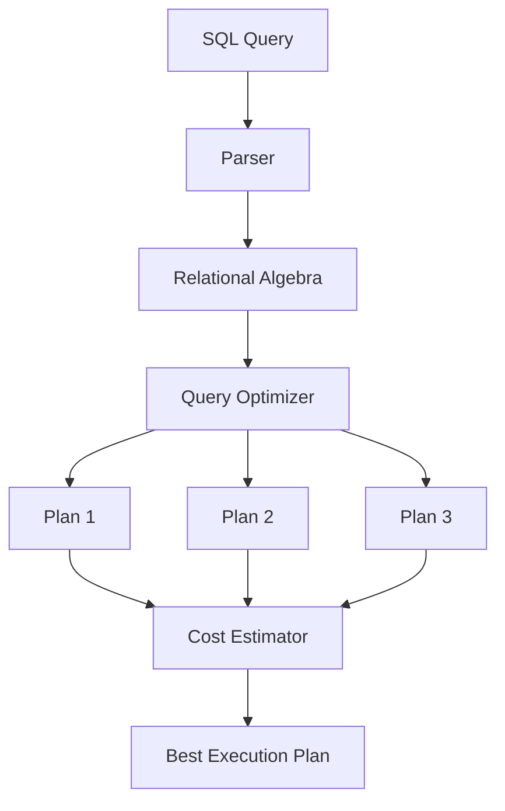
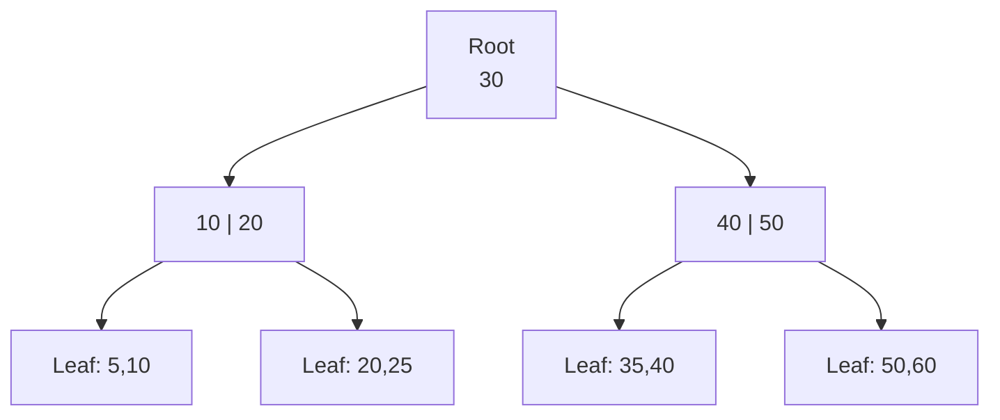

# Unit III - Query Processing and Storage

## 1. Query Processing

Query processing is the process of converting a high-level SQL query into an efficient low-level execution plan.

### Steps

### Explanation

- Parsing checks syntax and validity.
- Translation converts SQL into relational algebra.
- Optimization chooses the best plan.
- Execution plan describes access paths and join methods.
- Execution engine runs the plan and returns result.

### Conclusion

Query processing improves efficiency by converting user queries into optimized internal operations.

---

## 2. Query Optimization and Query Optimizer

Query optimization is the process of selecting the most efficient execution plan for a query. Since the same SQL query can be executed in many ways, the optimizer chooses the plan with minimum estimated cost.

### Types

| Type | Meaning |
|---|---|
| Heuristic optimization | Uses rules such as selection pushdown |
| Cost-based optimization | Uses statistics to estimate cost |

### Important Techniques

- Perform selection as early as possible.
- Perform projection early to reduce columns.
- Choose best join order.
- Use indexes where useful.
- Replace Cartesian product plus selection with join.

### Optimizer Diagram

### Conclusion

Query optimization is one of the most important functions of DBMS because it reduces response time and resource usage.

---

## 3. Indexing, B-Tree and B+ Tree

An index is a data structure that improves the speed of data retrieval. It works like an index in a book.

### Types of Indexes

| Type | Meaning |
|---|---|
| Primary index | Built on primary key or ordering key |
| Secondary index | Built on non-ordering attribute |
| Dense index | Contains entry for every search key |
| Sparse index | Contains entry for some search keys |

### B-Tree

- Balanced search tree.
- Keys and record pointers can appear in internal and leaf nodes.
- Search, insertion, and deletion are efficient.

### B+ Tree

- Internal nodes store only keys.
- Leaf nodes store data pointers.
- Leaf nodes are linked, so range queries are faster.

### B-Tree vs B+ Tree

| Basis | B-Tree | B+ Tree |
|---|---|---|
| Data pointers | Internal and leaf nodes | Only leaf nodes |
| Range query | Slower | Faster |
| Leaf links | Not necessary | Usually linked |
| DBMS use | Less common | Very common |

### Conclusion

B+ tree is widely used in DBMS indexing because it supports efficient searching and range queries.

---

## 4. Hashing in DBMS

Hashing maps a search key to a bucket address using a hash function.

### Terms

- Hash function: function that converts key into bucket address.
- Bucket: storage location for records.
- Collision: when two keys map to the same bucket.

### Types

| Type | Meaning |
|---|---|
| Static hashing | Fixed number of buckets |
| Dynamic hashing | Buckets grow or shrink as data changes |

### Collision Handling

- Overflow chaining.
- Open addressing.
- Rehashing.

### Conclusion

Hashing is useful for fast equality search, but it is not suitable for range queries.

---

## 5. Join Strategies

Join strategy decides how two relations are joined during query execution.

| Strategy | Meaning | Useful When |
|---|---|---|
| Nested loop join | Compares each tuple of outer relation with inner relation | Small tables |
| Indexed nested loop join | Uses index on inner relation | Index exists |
| Sort-merge join | Sorts both relations and merges | Large sorted tables |
| Hash join | Uses hash function on join attribute | Equality joins |

### Conclusion

Choosing a good join strategy is important because joins are usually expensive operations in query processing.

