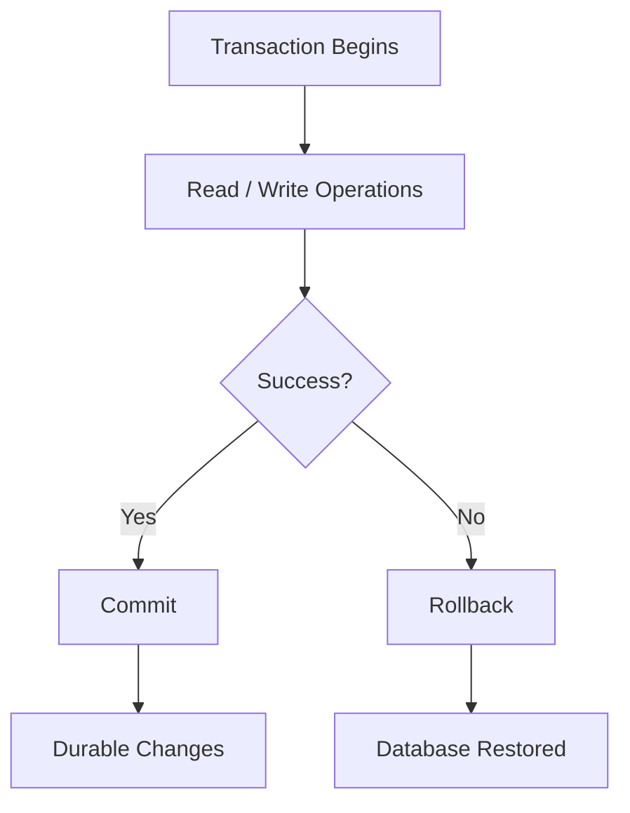
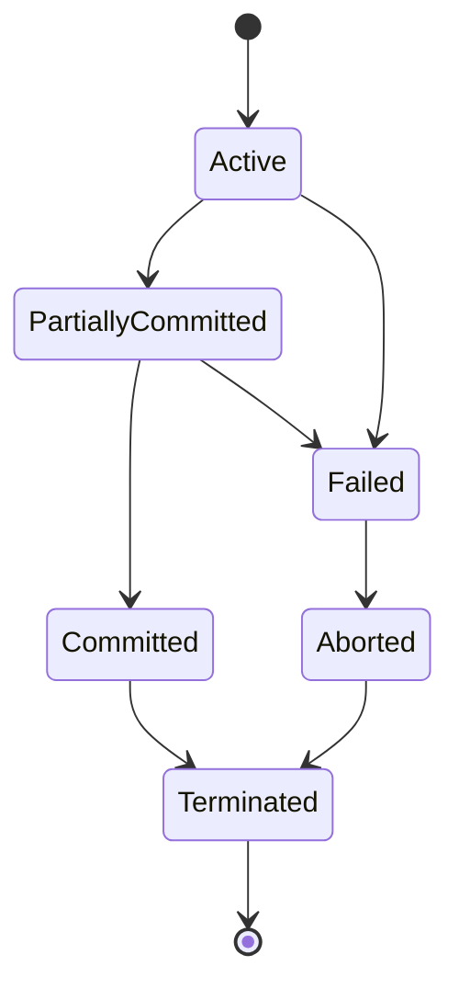
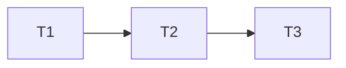
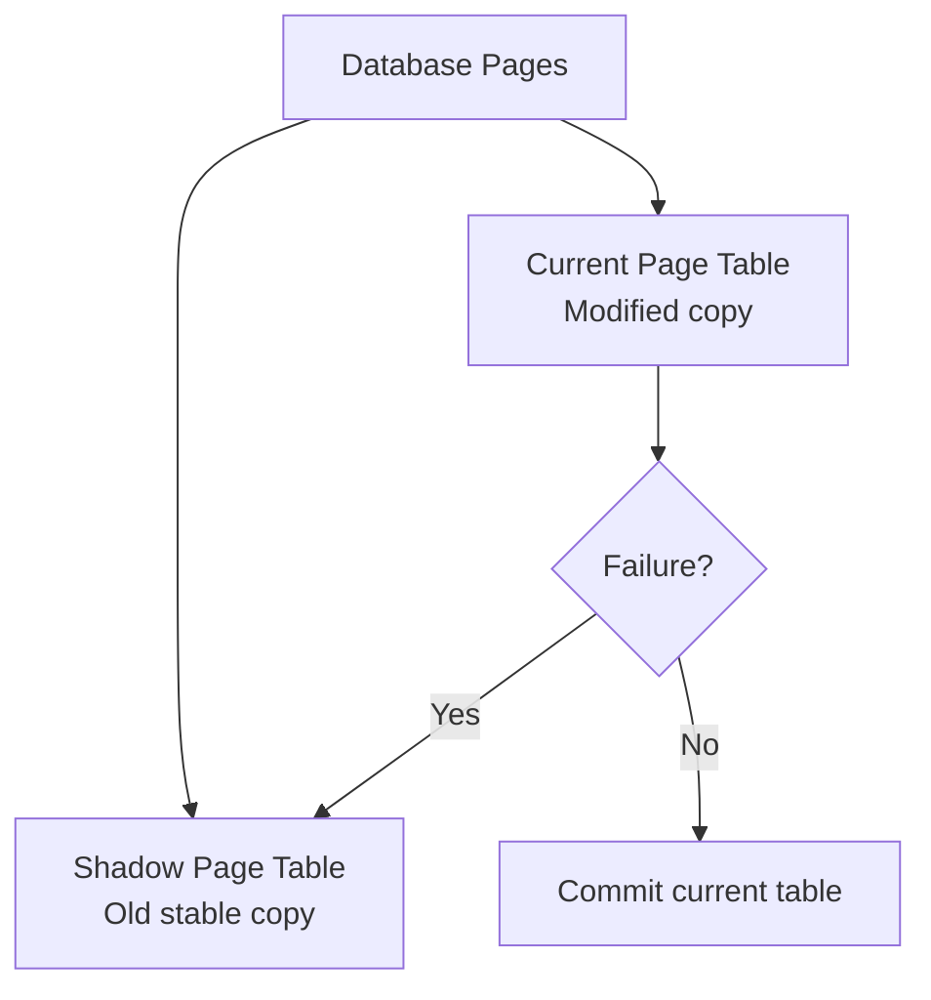

# Unit IV - Transactions and Concurrency

## 1. Transaction and ACID Properties

A transaction is a logical unit of work in a database. It consists of one or more operations such as read, write, insert, update, or delete. A transaction must be executed completely or not at all.

Example: Bank transfer of Rs. 1000 from account A to account B.

```text
Debit A by 1000
Credit B by 1000
```

Both operations must succeed together.

### ACID Properties

| Property | Meaning | Example |
|---|---|---|
| Atomicity | All operations occur or none occur | Debit and credit both happen |
| Consistency | Database moves from valid state to valid state | Total balance remains correct |
| Isolation | Concurrent transactions do not interfere | Two transfers appear separate |
| Durability | Committed changes are permanent | Data remains after power failure |

### Diagram



### Conclusion

ACID properties ensure correctness, reliability, and safety of database transactions.

---

## 2. Transaction States

### States

| State | Meaning |
|---|---|
| Active | Transaction is executing |
| Partially committed | Last statement executed |
| Committed | Changes saved permanently |
| Failed | Error or failure occurred |
| Aborted | Transaction rolled back |
| Terminated | Transaction leaves system |

### Diagram



### Conclusion

Transaction states help DBMS manage commit, rollback, failure recovery, and concurrency control.

---

## 3. Serializability

Serializability is a correctness criterion for concurrent schedules. A schedule is serializable if its result is equivalent to some serial schedule.

### Types

| Type | Meaning |
|---|---|
| Conflict serializability | Based on conflicting operations |
| View serializability | Based on same read and write effects |

### Conflicting Operations

Two operations conflict if:

- They belong to different transactions.
- They access the same data item.
- At least one operation is write.

Examples: R1(X) and W2(X), W1(X) and R2(X), W1(X) and W2(X).

### Precedence Graph Test

1. Create one node for each transaction.
2. Add edge Ti -> Tj if Ti has a conflicting operation before Tj.
3. If graph has no cycle, schedule is conflict serializable.



No cycle means conflict serializable.

### View Serializability

Two schedules are view equivalent if:

- Same transaction reads initial value.
- Same read-from relationship is preserved.
- Same transaction performs final write.

### Conclusion

Conflict serializability is easier to test using precedence graph. View serializability is more general but harder to test.

---

## 4. Concurrency Control and Locking

Concurrency control ensures correct execution of multiple transactions at the same time.

### Problems Without Concurrency Control

- Lost update.
- Dirty read.
- Unrepeatable read.
- Inconsistent retrieval.

### Locks

| Lock | Meaning |
|---|---|
| Shared lock | Used for read operation |
| Exclusive lock | Used for write operation |

### Lock Compatibility Matrix

| Requested / Held | Shared | Exclusive |
|---|---|---|
| Shared | Compatible | Not compatible |
| Exclusive | Not compatible | Not compatible |

### Two-Phase Locking

Two-phase locking has two phases:

1. Growing phase: transaction can acquire locks but cannot release locks.
2. Shrinking phase: transaction can release locks but cannot acquire new locks.


### Conclusion

Locking prevents conflicts in concurrent transactions. Two-phase locking guarantees conflict serializability but may cause deadlock.

---

## 5. Timestamp Ordering Protocol

Timestamp ordering protocol orders transactions using unique timestamps. Older transactions have smaller timestamps.

### Main Terms

- TS(T): timestamp of transaction T.
- RTS(X): largest timestamp of any transaction that successfully read X.
- WTS(X): largest timestamp of any transaction that successfully wrote X.

### Basic Idea

If an operation violates timestamp order, it is rejected and the transaction may be rolled back.

### Advantages

- Ensures serializability.
- No deadlock because transactions do not wait for locks.

### Disadvantages

- Rollbacks may increase.
- Starvation is possible for repeatedly aborted transactions.

### Conclusion

Timestamp ordering is a concurrency control technique that maintains serial order using transaction timestamps.

---

## 6. Database Recovery, Shadow Paging and Backup

Database recovery restores the database to a consistent state after failure.

### Failure Types

- Transaction failure.
- System crash.
- Disk failure.

### Recovery Techniques

| Technique | Meaning |
|---|---|
| Log-based recovery | Uses log records for undo/redo |
| Checkpointing | Saves consistent point to reduce recovery work |
| Shadow paging | Maintains old copy of page table |
| Backup and restore | Uses backup copy after failure |
| Online backup | Backup while database is running |

### Shadow Paging



### Conclusion

Recovery techniques protect the database from data loss and inconsistency after failures.

