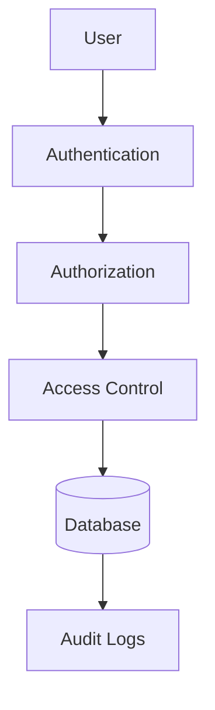
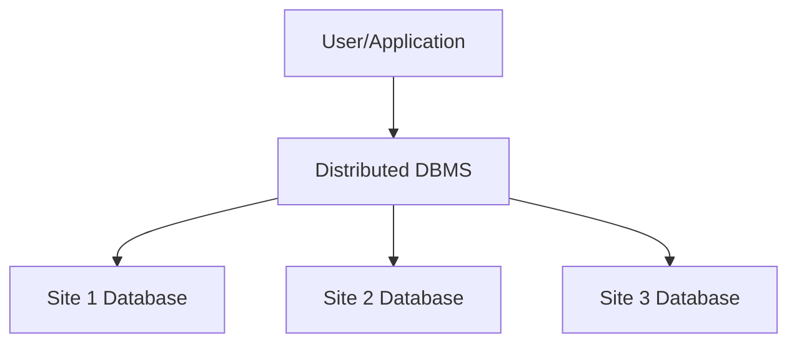
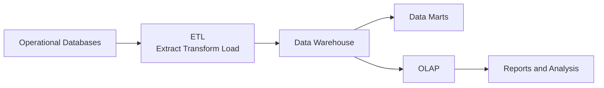
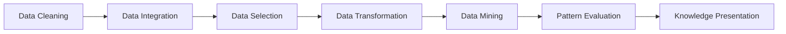

# Unit V - Security and Advanced DBMS Topics

## 1. Database Security

Database security protects data from unauthorized access, modification, disclosure, or destruction.

### Security Goals

| Goal | Meaning |
|---|---|
| Confidentiality | Only authorized users can view data |
| Integrity | Data remains accurate and valid |
| Availability | Data is available when needed |

### Security Measures

- Authentication.
- Authorization.
- Access control.
- Encryption.
- Auditing and logging.
- Backup and recovery.
- SQL injection prevention.
- Least privilege.

### Diagram



### Conclusion

Database security is essential because databases store sensitive and valuable information.

---

## 2. DAC, MAC and RBAC

Access control decides who can access which data and what operations they can perform.

### DAC - Discretionary Access Control

In DAC, the owner of an object decides permissions.

Example: Table owner grants SELECT permission to another user.

### MAC - Mandatory Access Control

In MAC, access is controlled by a central security policy using labels.

Example: Top Secret users can access Top Secret data.

### RBAC - Role-Based Access Control

In RBAC, permissions are assigned to roles, and users are assigned roles.

Example: Teacher role can update marks; Student role can only view marks.

### Comparison

| Basis | DAC | MAC | RBAC |
|---|---|---|---|
| Control | Owner | System policy | Roles |
| Flexibility | High | Low | Medium/High |
| Security | Moderate | Very high | High |
| Example use | Small systems | Military systems | Organizations |

### Conclusion

RBAC is widely used in organizations because it is easier to manage permissions through roles.

---

## 3. SQL Injection

SQL injection is an attack in which an attacker inserts malicious SQL code through input fields to access or modify unauthorized data.

### Example

Unsafe query:

```sql
SELECT * FROM Users
WHERE username = '$user' AND password = '$pass';
```

If attacker enters:

```text
' OR '1'='1
```

The condition may become always true.

### Prevention

- Use prepared statements.
- Validate input.
- Escape special characters.
- Use least privilege.
- Hide detailed error messages.
- Use stored procedures carefully.

### Conclusion

SQL injection is one of the most common database attacks. Prepared statements are the best defense.

---

## 4. Distributed Database

A distributed database is a database stored at multiple sites connected by a network, but it appears as a single logical database to users.

### Diagram



### Advantages

- Faster local access.
- Improved reliability.
- Scalability.
- Local autonomy.

### Disadvantages

- Complex design.
- Network dependency.
- Distributed recovery is difficult.
- Security is harder.

### Conclusion

Distributed databases are useful for organizations spread across multiple locations, but they require careful management.

---

## 5. Data Warehousing

A data warehouse is a subject-oriented, integrated, time-variant, and non-volatile collection of data used for decision making.

### Features

| Feature | Meaning |
|---|---|
| Subject-oriented | Organized around subjects like sales, customer |
| Integrated | Data from multiple sources |
| Time-variant | Stores historical data |
| Non-volatile | Data is stable and not frequently updated |

### Architecture



### Conclusion

Data warehouses support reporting, analysis, and decision making by storing historical integrated data.

---

## 6. Data Mining

Data mining is the process of extracting useful patterns, trends, and knowledge from large datasets.

### Techniques

| Technique | Meaning | Example |
|---|---|---|
| Classification | Assigns data into classes | Spam or not spam |
| Clustering | Groups similar data | Customer segments |
| Association | Finds relationships | Bread and butter bought together |
| Regression | Predicts numeric value | Sales prediction |
| Prediction | Forecasts future outcome | Demand forecasting |

### KDD Process



### Data Warehouse vs Data Mining

| Basis | Data Warehouse | Data Mining |
|---|---|---|
| Purpose | Stores historical data | Finds hidden patterns |
| Output | Reports, OLAP | Rules, trends, predictions |
| Nature | Repository | Analysis process |
| Users | Managers, analysts | Analysts, data scientists |

### Conclusion

Data mining discovers useful knowledge from data, while data warehousing provides the organized data source for analysis.

---

## 7. RDBMS vs OODBMS

| Basis | RDBMS | OODBMS |
|---|---|---|
| Storage | Tables | Objects |
| Data model | Relational | Object-oriented |
| Relationships | Primary key and foreign key | Object references |
| Query language | SQL | Object query language |
| Best for | Structured business data | Complex objects |
| Example | MySQL, Oracle | ObjectDB |

### Object-Relational DBMS

Object-relational DBMS combines relational tables with object-oriented features such as user-defined types and complex objects.

### Conclusion

RDBMS is best for structured data, while OODBMS is useful for complex data such as multimedia, CAD, and engineering objects.

