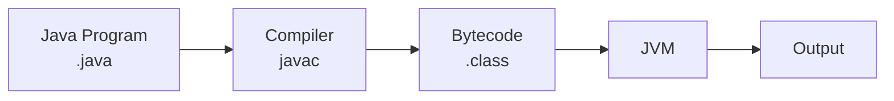
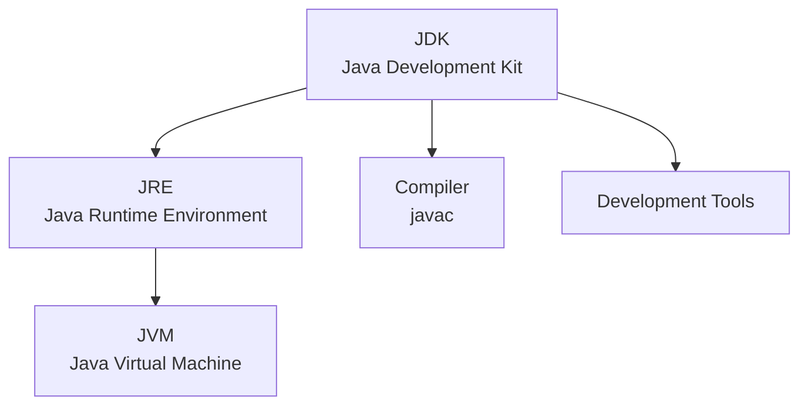
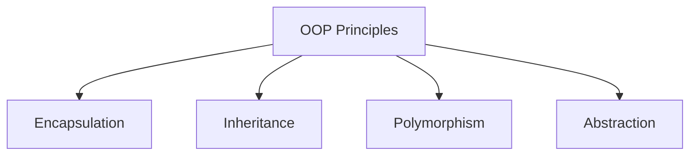
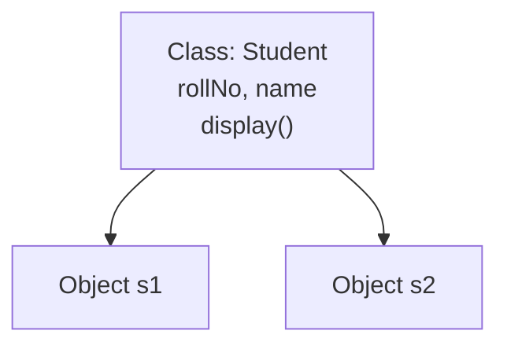
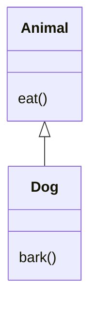
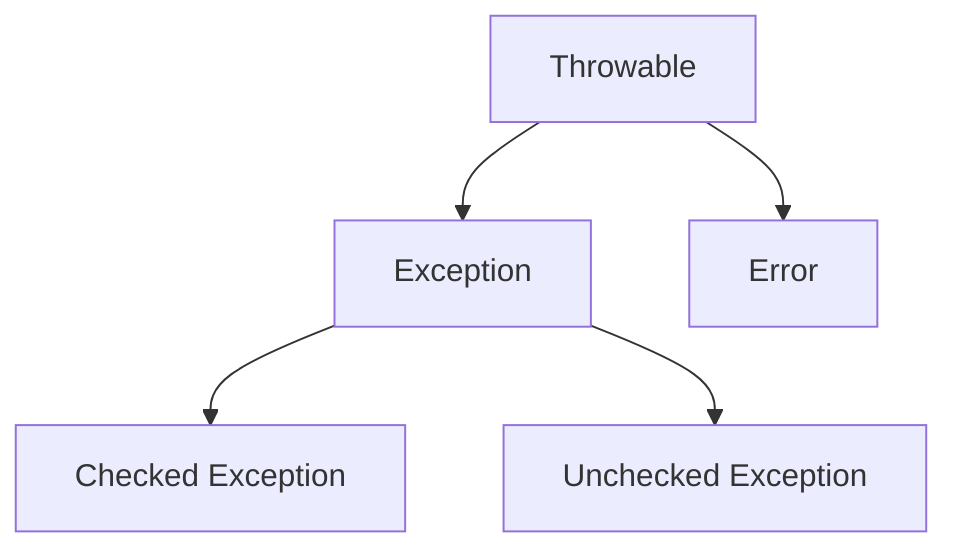
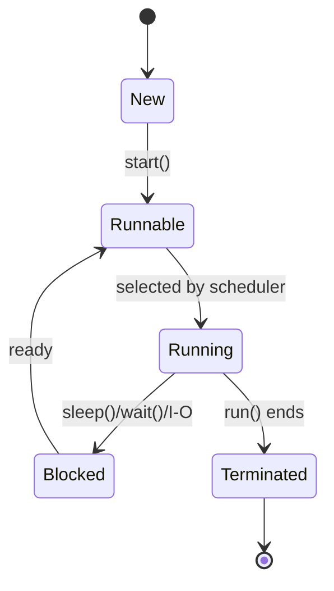
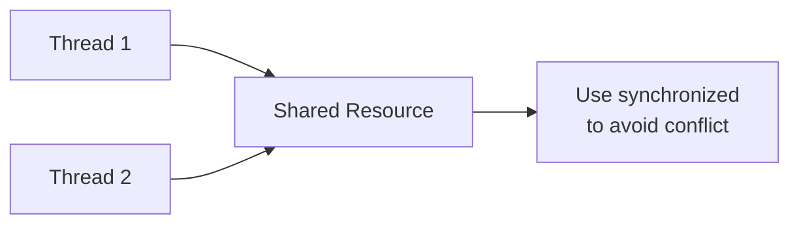
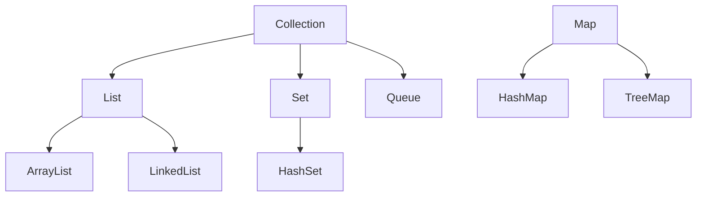
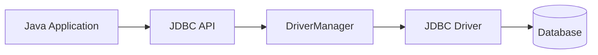

# Java 8 Marks Important Question Answers

Ye note direct exam-answer format me hai. Har answer me **definition**, **diagram/code**, **points**, aur **conclusion** diya hai.

---

# Unit I - Java Basics and OOP

## Q1. Explain the main features of Java.

### Answer

Java is a **high-level, object-oriented, platform-independent** programming language. Java source code is compiled into **bytecode**, and bytecode runs on the **Java Virtual Machine (JVM)**.



### Features

| Feature | Explanation |
|---|---|
| **Simple** | Java syntax is easy and similar to C/C++ |
| **Object-oriented** | Java uses classes and objects |
| **Platform independent** | Bytecode runs on any system with JVM |
| **Secure** | No pointer manipulation and has bytecode verification |
| **Robust** | Exception handling and memory management make it reliable |
| **Multithreaded** | Multiple tasks can execute simultaneously |
| **Portable** | Same code can run on different platforms |
| **Distributed** | Supports network-based applications |

### Conclusion

Java is widely used because of **platform independence**, **security**, **robustness**, and strong **OOP support**.

---

## Q2. Explain JVM, JRE and JDK.

### Answer

**JVM**, **JRE**, and **JDK** are important components of Java. They help in compiling, running, and executing Java programs.



| Term | Full Form | Meaning |
|---|---|---|
| **JVM** | Java Virtual Machine | Executes Java bytecode |
| **JRE** | Java Runtime Environment | JVM + libraries needed to run Java |
| **JDK** | Java Development Kit | JRE + compiler + development tools |

### Explanation

- **JVM** converts bytecode into machine-specific code.
- **JRE** provides the environment required to run Java applications.
- **JDK** is used by programmers to write, compile, and run Java programs.

### Conclusion

JDK is for development, JRE is for running programs, and JVM is responsible for executing bytecode.

---

## Q3. Explain OOP principles in Java.

### Answer

Object-Oriented Programming is a programming approach based on **classes** and **objects**. Java supports OOP to make programs **modular**, **reusable**, and **secure**.



### 1. Encapsulation

**Encapsulation** means wrapping data and methods into a single unit called class. It protects data using private variables.

```java
class Student {
    private int rollNo;

    public void setRollNo(int r) {
        rollNo = r;
    }

    public int getRollNo() {
        return rollNo;
    }
}
```

### 2. Inheritance

**Inheritance** allows one class to acquire properties of another class. It supports **code reusability**.

### 3. Polymorphism

**Polymorphism** means one name with many forms. It is achieved by **method overloading** and **method overriding**.

### 4. Abstraction

**Abstraction** means hiding internal details and showing only essential features. It is achieved using **abstract classes** and **interfaces**.

### Conclusion

OOP concepts make Java programs easier to maintain, reuse, and extend.

---

# Unit II - Class, Object, Constructor and Inheritance

## Q4. Explain class and object in Java with example.

### Answer

A **class** is a blueprint or template for creating objects. An **object** is an instance of a class. A class contains **data members** and **member methods**.



### Program

```java
class Student {
    int rollNo;
    String name;

    void display() {
        System.out.println(rollNo + " " + name);
    }

    public static void main(String[] args) {
        Student s1 = new Student();
        s1.rollNo = 1;
        s1.name = "Aman";
        s1.display();
    }
}
```

### Explanation

- `Student` is a **class**.
- `s1` is an **object**.
- `new` keyword allocates memory for the object.
- `display()` is a method used to print object data.

### Conclusion

Class and object are the foundation of Java programming because Java is an object-oriented language.

---

## Q5. What is constructor? Explain its types with example.

### Answer

A **constructor** is a special method used to initialize objects. It has the same name as the class and does not have any return type.

### Types of Constructors

| Type | Meaning |
|---|---|
| **Default constructor** | Constructor without parameters |
| **Parameterized constructor** | Constructor with parameters |
| **Copy constructor** | Creates object using another object; manually created in Java |

### Program

```java
class Student {
    int rollNo;
    String name;

    Student() {
        rollNo = 0;
        name = "Unknown";
    }

    Student(int r, String n) {
        rollNo = r;
        name = n;
    }

    void display() {
        System.out.println(rollNo + " " + name);
    }

    public static void main(String[] args) {
        Student s1 = new Student();
        Student s2 = new Student(1, "Aman");
        s1.display();
        s2.display();
    }
}
```

### Constructor vs Method

| Constructor | Method |
|---|---|
| Same name as class | Any valid name |
| No return type | Has return type |
| Called automatically | Called explicitly |
| Initializes object | Performs operation |

### Conclusion

Constructors are important because they initialize objects automatically at the time of object creation.

---

## Q6. Explain inheritance in Java with types and example.

### Answer

**Inheritance** is an OOP concept in which one class acquires the properties and methods of another class. The existing class is called **superclass**, and the new class is called **subclass**.



### Program

```java
class Animal {
    void eat() {
        System.out.println("Animal eats");
    }
}

class Dog extends Animal {
    void bark() {
        System.out.println("Dog barks");
    }

    public static void main(String[] args) {
        Dog d = new Dog();
        d.eat();
        d.bark();
    }
}
```

### Types of Inheritance in Java

| Type | Supported in Java? | Explanation |
|---|---|---|
| **Single** | Yes | One parent and one child |
| **Multilevel** | Yes | Parent -> Child -> Grandchild |
| **Hierarchical** | Yes | One parent and multiple children |
| **Multiple using classes** | No | Not supported to avoid ambiguity |
| **Multiple using interfaces** | Yes | Achieved through interfaces |

### Advantages

- Supports **code reusability**.
- Reduces code duplication.
- Supports **method overriding**.
- Helps achieve **runtime polymorphism**.

### Conclusion

Inheritance is useful for reusing existing code and building hierarchical relationships between classes.

---

# Unit III - Polymorphism, Abstract Class, Interface and Package

## Q7. Explain method overloading and method overriding.

### Answer

Method overloading and method overriding are used to achieve **polymorphism** in Java.

### Method Overloading

Method overloading means defining multiple methods with the same name but different parameter lists in the same class. It is an example of **compile-time polymorphism**.

```java
class Calculator {
    int add(int a, int b) {
        return a + b;
    }

    double add(double a, double b) {
        return a + b;
    }
}
```

### Method Overriding

Method overriding means redefining a parent class method in the child class with the same method signature. It is an example of **runtime polymorphism**.

```java
class Animal {
    void sound() {
        System.out.println("Animal sound");
    }
}

class Dog extends Animal {
    void sound() {
        System.out.println("Dog barks");
    }
}
```

### Difference

| Basis | Overloading | Overriding |
|---|---|---|
| Class | Same class | Parent-child classes |
| Parameters | Must be different | Must be same |
| Binding | Compile-time | Runtime |
| Purpose | Readability | Runtime polymorphism |

### Conclusion

Overloading improves readability, while overriding provides dynamic behavior in inheritance.

---

## Q8. Explain abstract class and interface. Differentiate them.

### Answer

An **abstract class** is a class declared with the `abstract` keyword. It can contain abstract and concrete methods. An **interface** is a blueprint of a class and is implemented using the `implements` keyword.

### Abstract Class Example

```java
abstract class Shape {
    abstract void draw();

    void message() {
        System.out.println("Drawing shape");
    }
}

class Circle extends Shape {
    void draw() {
        System.out.println("Drawing circle");
    }
}
```

### Interface Example

```java
interface Drawable {
    void draw();
}

class Rectangle implements Drawable {
    public void draw() {
        System.out.println("Drawing rectangle");
    }
}
```

### Difference

| Basis | Abstract Class | Interface |
|---|---|---|
| Keyword | abstract | interface |
| Used by | extends | implements |
| Methods | Abstract and concrete | Abstract, default, static |
| Variables | Instance variables allowed | public static final by default |
| Constructor | Allowed | Not allowed |
| Multiple inheritance | Not possible through classes | Possible |

### Conclusion

Abstract class is used for common base behavior, while interface is used to define a common contract.

---

## Q9. Explain packages and access modifiers in Java.

### Answer

A **package** is a group of related classes and interfaces. It is used for **code organization**, **namespace management**, and **access protection**.

### Types of Packages

| Type | Example |
|---|---|
| **Built-in package** | `java.util`, `java.io`, `java.sql` |
| **User-defined package** | `mypack` |

### Package Example

```java
package mypack;

public class Message {
    public void show() {
        System.out.println("Hello Package");
    }
}
```

### Access Modifiers

| Modifier | Same class | Same package | Subclass | Outside package |
|---|---|---|---|---|
| **private** | Yes | No | No | No |
| **default** | Yes | Yes | No | No |
| **protected** | Yes | Yes | Yes | Limited |
| **public** | Yes | Yes | Yes | Yes |

### Advantages of Packages

- Avoids naming conflicts.
- Makes code modular.
- Provides access control.
- Helps in code reusability.

### Conclusion

Packages and access modifiers make Java programs organized, secure, and maintainable.

---

# Unit IV - Exception Handling and Multithreading

## Q10. Explain exception handling in Java with example.

### Answer

An **exception** is an abnormal condition that occurs during program execution. Exception handling is a mechanism used to handle runtime errors and maintain normal program flow.



### Keywords

| Keyword | Use |
|---|---|
| **try** | Contains risky code |
| **catch** | Handles exception |
| **finally** | Always executes |
| **throw** | Throws exception manually |
| **throws** | Declares exception |

### Program

```java
class ExceptionDemo {
    public static void main(String[] args) {
        try {
            int a = 10 / 0;
            System.out.println(a);
        } catch (ArithmeticException e) {
            System.out.println("Cannot divide by zero");
        } finally {
            System.out.println("Finally block executed");
        }
    }
}
```

### Checked vs Unchecked Exception

| Checked Exception | Unchecked Exception |
|---|---|
| Checked at compile time | Checked at runtime |
| Example: IOException | Example: ArithmeticException |
| Must be handled or declared | Handling is optional |

### Conclusion

Exception handling makes Java programs **robust**, **safe**, and **reliable**.

---

## Q11. Explain multithreading and thread life cycle in Java.

### Answer

**Multithreading** is the process of executing multiple threads simultaneously. A **thread** is a lightweight sub-process. Java supports multithreading through the **Thread class** and **Runnable interface**.



### Creating Thread

```java
class MyThread extends Thread {
    public void run() {
        System.out.println("Thread is running");
    }

    public static void main(String[] args) {
        MyThread t = new MyThread();
        t.start();
    }
}
```

### Thread States

| State | Meaning |
|---|---|
| **New** | Thread object is created |
| **Runnable** | Thread is ready to run |
| **Running** | Thread is executing |
| **Blocked/Waiting** | Thread is temporarily inactive |
| **Terminated** | Thread execution is completed |

### Advantages

- Better CPU utilization.
- Faster execution.
- Useful for games, servers, animations, and background tasks.

### Conclusion

Multithreading improves performance and responsiveness of Java applications.

---

## Q12. What is synchronization in Java? Explain with example.

### Answer

**Synchronization** is a technique used to control access to shared resources by multiple threads. It prevents **race condition** and data inconsistency.

### Need

When two or more threads access the same data at the same time, incorrect result may occur. Synchronization allows only one thread at a time to access a critical section.



### Program

```java
class Counter {
    int count = 0;

    synchronized void increment() {
        count++;
    }
}
```

### Important Points

- `synchronized` keyword is used.
- It prevents race condition.
- It ensures data consistency.
- Overuse can reduce performance.

### Conclusion

Synchronization is important in multithreaded programs where multiple threads share common data.

---

# Unit V - Collections and JDBC

## Q13. Explain Java Collections Framework.

### Answer

The **Collections Framework** is a set of classes and interfaces used to store, retrieve, and manipulate groups of objects. It is available in the **java.util** package.



### Important Classes

| Class/Interface | Use |
|---|---|
| **List** | Ordered collection, allows duplicates |
| **Set** | Unique elements |
| **Queue** | Stores elements for processing |
| **Map** | Stores key-value pairs |
| **ArrayList** | Dynamic array |
| **HashMap** | Key-value data |

### Program

```java
import java.util.ArrayList;

class ArrayListDemo {
    public static void main(String[] args) {
        ArrayList<String> list = new ArrayList<>();
        list.add("Aman");
        list.add("Riya");

        for (String name : list) {
            System.out.println(name);
        }
    }
}
```

### Advantages

- Provides ready-made data structures.
- Reduces programming effort.
- Supports searching, sorting, insertion, and deletion.
- Uses **generics** for type safety.

### Conclusion

Collections Framework is useful for efficient handling of groups of objects.

---

## Q14. Explain JDBC architecture and steps to connect Java with database.

### Answer

**JDBC** stands for **Java Database Connectivity**. It is an API used to connect Java applications with databases and execute SQL queries.



### JDBC Steps

1. Import `java.sql` package.
2. Load/register JDBC driver.
3. Create connection.
4. Create statement.
5. Execute query.
6. Process result.
7. Close connection.

### Program

```java
import java.sql.*;

class JdbcDemo {
    public static void main(String[] args) throws Exception {
        Class.forName("com.mysql.cj.jdbc.Driver");

        Connection con = DriverManager.getConnection(
            "jdbc:mysql://localhost:3306/testdb", "root", "password"
        );

        Statement st = con.createStatement();
        ResultSet rs = st.executeQuery("SELECT * FROM student");

        while (rs.next()) {
            System.out.println(rs.getInt(1) + " " + rs.getString(2));
        }

        con.close();
    }
}
```

### Important Interfaces

| Interface/Class | Use |
|---|---|
| **DriverManager** | Manages drivers |
| **Connection** | Connects to database |
| **Statement** | Executes SQL |
| **PreparedStatement** | Executes parameterized query |
| **ResultSet** | Stores query result |

### Conclusion

JDBC is important because it allows Java programs to communicate with relational databases.

---

## Q15. Differentiate String and StringBuffer in Java.

### Answer

**String** and **StringBuffer** are used to handle text in Java. The main difference is that **String is immutable**, while **StringBuffer is mutable**.

### String Example

```java
class StringDemo {
    public static void main(String[] args) {
        String s = "Java";
        s.concat(" Language");
        System.out.println(s);
    }
}
```

Output:

```text
Java
```

### StringBuffer Example

```java
class StringBufferDemo {
    public static void main(String[] args) {
        StringBuffer sb = new StringBuffer("Java");
        sb.append(" Language");
        System.out.println(sb);
    }
}
```

Output:

```text
Java Language
```

### Difference

| Basis | String | StringBuffer |
|---|---|---|
| Mutability | Immutable | Mutable |
| Modification | Creates new object | Modifies same object |
| Speed | Slower for many changes | Faster for many changes |
| Thread safety | Not synchronized | Synchronized |
| Use | Fixed text | Frequently changing text |

### Conclusion

Use **String** for constant text and **StringBuffer** when text changes frequently.

