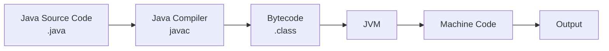
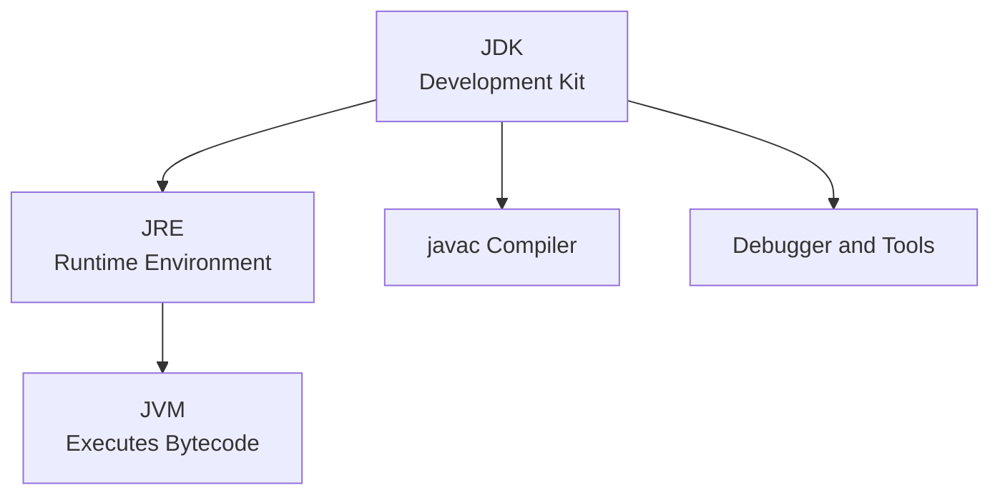
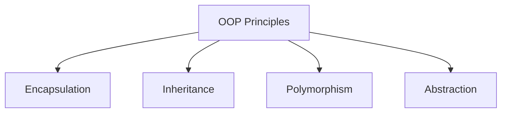
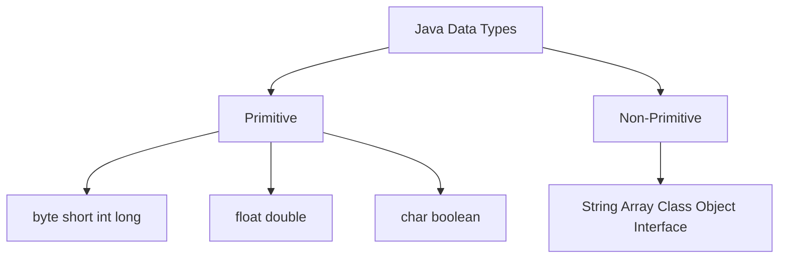

# Unit I - Java Basics and OOP Fundamentals

## 1. Features of Java

### 8-Mark Answer

Java is a **high-level, object-oriented, platform-independent programming language** developed by Sun Microsystems. Java programs are compiled into **bytecode**, which runs on the **Java Virtual Machine (JVM)**.

### Important Features

| Feature | Meaning |
|---|---|
| **Simple** | Syntax is easy and similar to C/C++ |
| **Object-oriented** | Based on classes and objects |
| **Platform independent** | Bytecode can run on any machine with JVM |
| **Secure** | No pointer access and has bytecode verification |
| **Robust** | Strong memory management and exception handling |
| **Multithreaded** | Supports multiple tasks at the same time |
| **Distributed** | Supports network-based applications |
| **Portable** | Same program can run on different systems |

### Java Execution Diagram



### Conclusion

Java is popular because of **platform independence**, **security**, **robustness**, and strong support for **object-oriented programming**.

---

## 2. JVM, JRE and JDK

### Definition

**JVM**, **JRE**, and **JDK** are core parts of Java execution.

| Term | Full Form | Use |
|---|---|---|
| **JVM** | Java Virtual Machine | Executes bytecode |
| **JRE** | Java Runtime Environment | JVM + libraries required to run Java |
| **JDK** | Java Development Kit | JRE + compiler + development tools |

### Diagram



### Key Points

- **JDK** is needed to develop and compile Java programs.
- **JRE** is needed only to run Java programs.
- **JVM** converts bytecode into machine-specific instructions.

### Conclusion

JDK is for developers, JRE is for users, and JVM is the engine that runs Java bytecode.

---

## 3. Object-Oriented Programming Principles

### 8-Mark Answer

Object-Oriented Programming is a programming approach based on **objects**. An object contains **data** and **methods**. Java supports OOP to make programs modular, reusable, secure, and easy to maintain.

### Main OOP Principles



### 1. Encapsulation

**Encapsulation** means wrapping data and methods together in a class. Data is usually made private and accessed using getter and setter methods.

```java
class Student {
    private int rollNo;

    public void setRollNo(int r) {
        rollNo = r;
    }

    public int getRollNo() {
        return rollNo;
    }
}
```

### 2. Inheritance

**Inheritance** allows one class to acquire properties and methods of another class. It supports **code reusability**.

```java
class Animal {
    void eat() {
        System.out.println("Eating");
    }
}

class Dog extends Animal {
    void bark() {
        System.out.println("Barking");
    }
}
```

### 3. Polymorphism

**Polymorphism** means one name with many forms. In Java, it is achieved by **method overloading** and **method overriding**.

### 4. Abstraction

**Abstraction** means showing essential details and hiding internal implementation. It is achieved using **abstract classes** and **interfaces**.

### Conclusion

OOP makes Java programs **modular**, **reusable**, **secure**, and **easy to extend**.

---

## 4. Structure of a Java Program

### Program

```java
class HelloWorld {
    public static void main(String[] args) {
        System.out.println("Hello Java");
    }
}
```

### Explanation

| Part | Meaning |
|---|---|
| **class HelloWorld** | Defines a class named HelloWorld |
| **public** | Access modifier |
| **static** | main method can run without object |
| **void** | main does not return value |
| **main** | Starting point of program |
| **String[] args** | Command-line arguments |
| **System.out.println** | Prints output |

### Conclusion

Every Java program contains at least one class, and execution begins from the **main()** method.

---

## 5. Data Types in Java

Java data types are divided into **primitive** and **non-primitive** data types.



### Primitive Data Types

| Type | Example |
|---|---|
| int | 10 |
| float | 10.5f |
| double | 99.99 |
| char | 'A' |
| boolean | true |

### Conclusion

Primitive data types store simple values, while non-primitive data types store references to objects.

