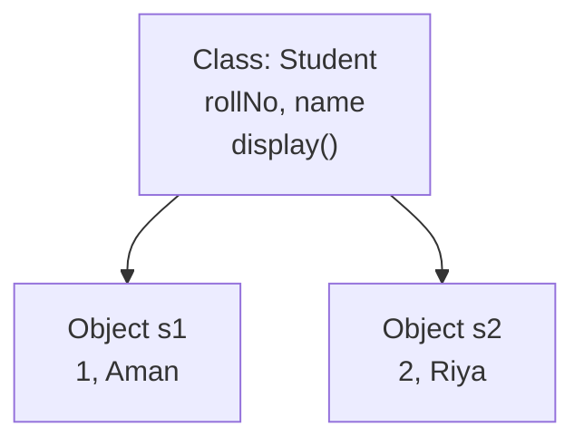
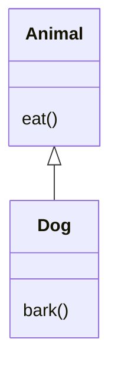

# Unit II - Classes Objects Constructors and Inheritance

## 1. Class and Object

### 8-Mark Answer

A **class** is a blueprint or template used to create objects. An **object** is a real-world entity created from a class. A class contains **data members** and **member functions**.

### Diagram



### Program

```java
class Student {
    int rollNo;
    String name;

    void display() {
        System.out.println(rollNo + " " + name);
    }

    public static void main(String[] args) {
        Student s1 = new Student();
        s1.rollNo = 1;
        s1.name = "Aman";
        s1.display();
    }
}
```

### Important Points

- **Class** is logical representation.
- **Object** is physical/runtime representation.
- Objects are created using the **new** keyword.
- Each object has its own copy of instance variables.

### Conclusion

Classes and objects are the foundation of Java OOP. They help represent real-world entities in programming.

---

## 2. Constructors in Java

### Definition

A **constructor** is a special method used to initialize objects. It has the same name as the class and has no return type.

### Types of Constructors

| Type | Meaning |
|---|---|
| **Default constructor** | No parameters |
| **Parameterized constructor** | Accepts parameters |
| **Copy constructor** | Creates object using another object, manually defined in Java |

### Program

```java
class Student {
    int rollNo;
    String name;

    Student() {
        rollNo = 0;
        name = "Unknown";
    }

    Student(int r, String n) {
        rollNo = r;
        name = n;
    }

    void display() {
        System.out.println(rollNo + " " + name);
    }

    public static void main(String[] args) {
        Student s1 = new Student();
        Student s2 = new Student(1, "Aman");
        s1.display();
        s2.display();
    }
}
```

### Constructor vs Method

| Constructor | Method |
|---|---|
| Same name as class | Any valid name |
| No return type | Has return type |
| Called automatically | Called manually |
| Initializes object | Performs operation |

### Conclusion

Constructors make object initialization simple and automatic.

---

## 3. Inheritance in Java

### 8-Mark Answer

**Inheritance** is an OOP concept in which one class acquires the properties and methods of another class. The class whose properties are inherited is called **superclass**, and the class that inherits is called **subclass**.

### Syntax

```java
class Child extends Parent {
    // members
}
```

### Diagram



### Program

```java
class Animal {
    void eat() {
        System.out.println("Animal eats");
    }
}

class Dog extends Animal {
    void bark() {
        System.out.println("Dog barks");
    }

    public static void main(String[] args) {
        Dog d = new Dog();
        d.eat();
        d.bark();
    }
}
```

### Types of Inheritance in Java

| Type | Supported? | Meaning |
|---|---|---|
| Single | Yes | One parent, one child |
| Multilevel | Yes | Parent -> Child -> Grandchild |
| Hierarchical | Yes | One parent, many children |
| Multiple using classes | No | Avoided due to ambiguity |
| Multiple using interfaces | Yes | Achieved using interfaces |

### Why Java Does Not Support Multiple Inheritance Using Classes

Java does not support multiple inheritance with classes to avoid the **diamond problem**, where ambiguity occurs if two parent classes contain the same method.

### Conclusion

Inheritance supports **code reusability**, **method overriding**, and **runtime polymorphism**.

---

## 4. this and super Keywords

### this Keyword

**this** refers to the current object.

Uses:

- Refers to current class instance variable.
- Calls current class method.
- Calls current class constructor.

```java
class Student {
    int rollNo;

    Student(int rollNo) {
        this.rollNo = rollNo;
    }
}
```

### super Keyword

**super** refers to the immediate parent class object.

Uses:

- Calls parent class variable.
- Calls parent class method.
- Calls parent class constructor.

```java
class Animal {
    void sound() {
        System.out.println("Animal sound");
    }
}

class Dog extends Animal {
    void sound() {
        super.sound();
        System.out.println("Dog barks");
    }
}
```

### Difference

| this | super |
|---|---|
| Refers current class object | Refers parent class object |
| Used for current class members | Used for parent class members |
| this() calls current constructor | super() calls parent constructor |

### Conclusion

**this** and **super** remove ambiguity and help in constructor and method chaining.

