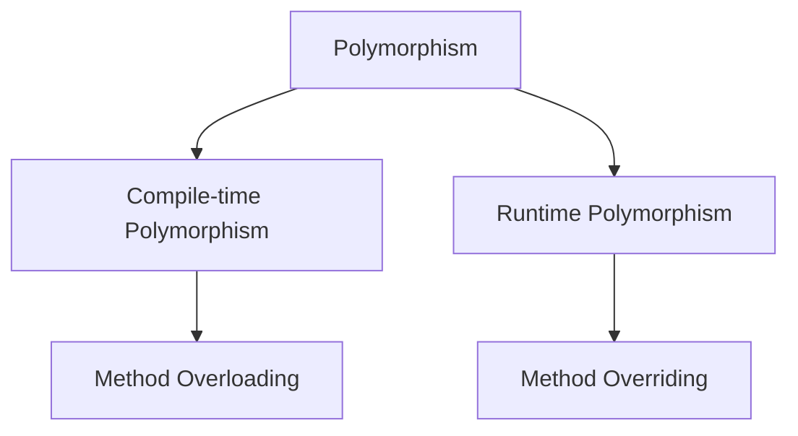

# Unit III - Polymorphism Abstract Classes Interfaces and Packages

## 1. Polymorphism in Java

### 8-Mark Answer

**Polymorphism** means one name with many forms. In Java, polymorphism allows the same method name to behave differently in different situations.

### Types



### Compile-Time Polymorphism

Achieved by **method overloading**. The method call is resolved at compile time.

```java
class Calculator {
    int add(int a, int b) {
        return a + b;
    }

    double add(double a, double b) {
        return a + b;
    }
}
```

### Runtime Polymorphism

Achieved by **method overriding**. The method call is resolved at runtime.

```java
class Animal {
    void sound() {
        System.out.println("Animal sound");
    }
}

class Dog extends Animal {
    void sound() {
        System.out.println("Dog barks");
    }
}

class Test {
    public static void main(String[] args) {
        Animal a = new Dog();
        a.sound();
    }
}
```

### Conclusion

Polymorphism increases **flexibility**, **reusability**, and **extensibility** of Java programs.

---

## 2. Method Overloading vs Method Overriding

| Basis | Method Overloading | Method Overriding |
|---|---|---|
| Meaning | Same method name with different parameters | Subclass redefines parent method |
| Class | Same class | Parent-child classes |
| Parameters | Must be different | Must be same |
| Return type | Can be same or different | Same or covariant |
| Binding | Compile-time | Runtime |
| Purpose | Readability | Runtime polymorphism |

### Overloading Example

```java
class Display {
    void show(int a) {
        System.out.println(a);
    }

    void show(String s) {
        System.out.println(s);
    }
}
```

### Overriding Example

```java
class Bank {
    int rate() {
        return 5;
    }
}

class SBI extends Bank {
    int rate() {
        return 7;
    }
}
```

### Conclusion

Overloading provides **compile-time polymorphism**, while overriding provides **runtime polymorphism**.

---

## 3. Abstract Class

### Definition

An **abstract class** is a class declared with the **abstract** keyword. It may contain abstract methods and concrete methods. It cannot be instantiated directly.

### Program

```java
abstract class Shape {
    abstract void draw();

    void message() {
        System.out.println("Drawing shape");
    }
}

class Circle extends Shape {
    void draw() {
        System.out.println("Drawing circle");
    }

    public static void main(String[] args) {
        Shape s = new Circle();
        s.message();
        s.draw();
    }
}
```

### Important Points

- Abstract class can have **abstract** and **non-abstract** methods.
- It can have constructors.
- It can have instance variables.
- Object cannot be created directly.

### Conclusion

Abstract class is used when common behavior is shared by related classes, but some methods must be implemented by subclasses.

---

## 4. Interface in Java

### Definition

An **interface** is a blueprint of a class. It contains abstract methods by default, and a class implements an interface using the **implements** keyword.

### Program

```java
interface Drawable {
    void draw();
}

class Rectangle implements Drawable {
    public void draw() {
        System.out.println("Drawing rectangle");
    }

    public static void main(String[] args) {
        Drawable d = new Rectangle();
        d.draw();
    }
}
```

### Uses

- Achieves **abstraction**.
- Supports **multiple inheritance**.
- Provides loose coupling.

### Abstract Class vs Interface

| Basis | Abstract Class | Interface |
|---|---|---|
| Keyword | abstract | interface |
| Inheritance | extends | implements |
| Methods | Abstract and concrete | Abstract, default, static |
| Variables | Instance variables allowed | public static final by default |
| Constructor | Allowed | Not allowed |
| Multiple inheritance | Not supported by class | Supported |

### Conclusion

Interfaces are used to define a contract that implementing classes must follow.

---

## 5. Packages in Java

### Definition

A **package** is a group of related classes and interfaces. Packages help in **code organization**, **name conflict removal**, and **access protection**.

### Types

| Type | Example |
|---|---|
| Built-in package | java.util, java.io, java.sql |
| User-defined package | mypack |

### Creating Package

```java
package mypack;

public class Message {
    public void show() {
        System.out.println("Hello from package");
    }
}
```

### Using Package

```java
import mypack.Message;

class Test {
    public static void main(String[] args) {
        Message m = new Message();
        m.show();
    }
}
```

### Access Modifiers

| Modifier | Same class | Same package | Subclass | Outside package |
|---|---|---|---|---|
| private | Yes | No | No | No |
| default | Yes | Yes | No | No |
| protected | Yes | Yes | Yes | No direct access |
| public | Yes | Yes | Yes | Yes |

### Conclusion

Packages make Java programs modular and manageable.

