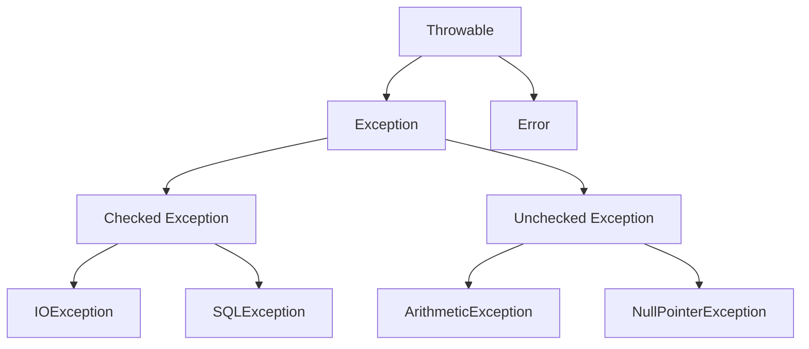
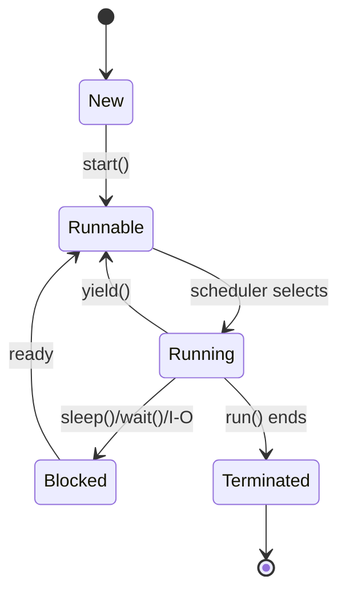

# Unit IV - Exceptions Multithreading and I-O

## 1. Exception Handling in Java

### 8-Mark Answer

An **exception** is an abnormal condition that occurs during program execution and disrupts the normal flow of the program. Java provides exception handling to make programs **robust** and **fault tolerant**.

### Exception Hierarchy



### Keywords

| Keyword | Use |
|---|---|
| **try** | Contains risky code |
| **catch** | Handles exception |
| **finally** | Always executes |
| **throw** | Throws exception manually |
| **throws** | Declares exception |

### Program

```java
class ExceptionDemo {
    public static void main(String[] args) {
        try {
            int a = 10 / 0;
            System.out.println(a);
        } catch (ArithmeticException e) {
            System.out.println("Cannot divide by zero");
        } finally {
            System.out.println("Finally block executed");
        }
    }
}
```

### Checked vs Unchecked Exceptions

| Basis | Checked Exception | Unchecked Exception |
|---|---|---|
| Checked by compiler | Yes | No |
| Package | Exception except RuntimeException | RuntimeException |
| Example | IOException, SQLException | ArithmeticException, NullPointerException |

### Conclusion

Exception handling prevents abnormal program termination and improves reliability.

---

## 2. throw vs throws

| Basis | throw | throws |
|---|---|---|
| Use | Throws exception manually | Declares possible exception |
| Position | Inside method | In method signature |
| Number | Throws one exception object | Can declare multiple exceptions |
| Example | throw new ArithmeticException() | void read() throws IOException |

### Example

```java
class Test {
    static void checkAge(int age) {
        if (age < 18) {
            throw new ArithmeticException("Not eligible");
        }
        System.out.println("Eligible");
    }

    public static void main(String[] args) {
        checkAge(16);
    }
}
```

---

## 3. Multithreading in Java

### 8-Mark Answer

**Multithreading** is a process of executing multiple threads simultaneously. A **thread** is a lightweight sub-process. Java supports multithreading to perform multiple tasks at the same time.

### Thread Life Cycle



### Creating Thread by Extending Thread Class

```java
class MyThread extends Thread {
    public void run() {
        System.out.println("Thread is running");
    }

    public static void main(String[] args) {
        MyThread t = new MyThread();
        t.start();
    }
}
```

### Creating Thread by Implementing Runnable

```java
class MyTask implements Runnable {
    public void run() {
        System.out.println("Task is running");
    }

    public static void main(String[] args) {
        Thread t = new Thread(new MyTask());
        t.start();
    }
}
```

### Thread Class vs Runnable Interface

| Thread Class | Runnable Interface |
|---|---|
| Class extends Thread | Class implements Runnable |
| No other class can be extended | Another class can still be extended |
| Less flexible | More flexible |

### Conclusion

Multithreading improves CPU utilization and makes programs faster and more responsive.

---

## 4. Synchronization

### Definition

**Synchronization** is used to control access to shared resources by multiple threads. It prevents data inconsistency.

### Need

If two threads update the same data at the same time, wrong output may occur. Synchronization allows only one thread at a time to access a critical section.

### Program

```java
class Counter {
    int count = 0;

    synchronized void increment() {
        count++;
    }
}
```

### Important Points

- Achieved using **synchronized** keyword.
- Prevents **race condition**.
- May reduce performance if overused.

### Conclusion

Synchronization is important in multithreaded programs to maintain data consistency.

---

## 5. File Handling in Java

### Definition

File handling is used to create, read, write, and delete files. Java provides classes in the **java.io** package for file operations.

### Common Classes

| Class | Use |
|---|---|
| File | Represents file or directory |
| FileWriter | Writes character data |
| FileReader | Reads character data |
| BufferedReader | Reads text efficiently |
| FileInputStream | Reads bytes |
| FileOutputStream | Writes bytes |

### Write File Program

```java
import java.io.FileWriter;
import java.io.IOException;

class WriteFile {
    public static void main(String[] args) throws IOException {
        FileWriter fw = new FileWriter("data.txt");
        fw.write("Hello Java File Handling");
        fw.close();
        System.out.println("File written");
    }
}
```

### Read File Program

```java
import java.io.FileReader;
import java.io.IOException;

class ReadFile {
    public static void main(String[] args) throws IOException {
        FileReader fr = new FileReader("data.txt");
        int ch;
        while ((ch = fr.read()) != -1) {
            System.out.print((char) ch);
        }
        fr.close();
    }
}
```

### Conclusion

File handling allows Java programs to store data permanently in files.

