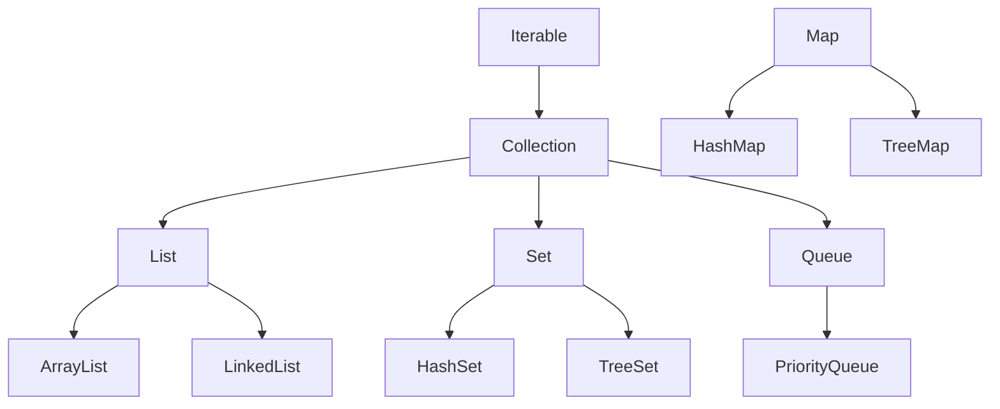
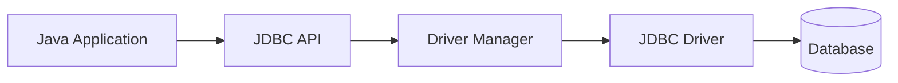

# Unit V - Collections JDBC and Important Programs

## 1. Collections Framework

### 8-Mark Answer

The **Collections Framework** in Java is a set of classes and interfaces used to store and manipulate groups of objects. It is present in the **java.util** package.

### Collection Hierarchy



### Important Interfaces and Classes

| Interface/Class | Use |
|---|---|
| **List** | Ordered collection, allows duplicates |
| **Set** | Does not allow duplicates |
| **Queue** | Follows processing order |
| **Map** | Stores key-value pairs |
| **ArrayList** | Dynamic array |
| **LinkedList** | Node-based list |
| **HashSet** | Unique unordered elements |
| **HashMap** | Key-value storage |

### ArrayList Program

```java
import java.util.ArrayList;

class ArrayListDemo {
    public static void main(String[] args) {
        ArrayList<String> names = new ArrayList<>();
        names.add("Aman");
        names.add("Riya");
        names.add("Kabir");

        for (String name : names) {
            System.out.println(name);
        }
    }
}
```

### Advantages

- Ready-made data structures.
- Reduces programming effort.
- Provides searching, sorting, insertion, and deletion methods.
- Uses **generics** for type safety.

### Conclusion

Collections Framework is useful for managing groups of objects efficiently.

---

## 2. ArrayList vs LinkedList

| Basis | ArrayList | LinkedList |
|---|---|---|
| Internal structure | Dynamic array | Doubly linked list |
| Access speed | Fast | Slow |
| Insertion/deletion | Slower in middle | Faster in middle |
| Memory | Less overhead | More overhead due to links |
| Best use | Searching and reading | Frequent insertion/deletion |

### Conclusion

Use **ArrayList** when searching is frequent. Use **LinkedList** when insertion and deletion are frequent.

---

## 3. JDBC

### 8-Mark Answer

**JDBC** stands for Java Database Connectivity. It is an API used to connect Java applications with databases. It allows Java programs to execute SQL queries and process results.

### JDBC Architecture



### JDBC Steps

1. Import package.
2. Load/register driver.
3. Create connection.
4. Create statement.
5. Execute query.
6. Process result.
7. Close connection.

### JDBC Program

```java
import java.sql.*;

class JdbcDemo {
    public static void main(String[] args) throws Exception {
        Class.forName("com.mysql.cj.jdbc.Driver");

        Connection con = DriverManager.getConnection(
            "jdbc:mysql://localhost:3306/testdb", "root", "password"
        );

        Statement st = con.createStatement();
        ResultSet rs = st.executeQuery("SELECT * FROM student");

        while (rs.next()) {
            System.out.println(rs.getInt(1) + " " + rs.getString(2));
        }

        con.close();
    }
}
```

### Important JDBC Interfaces

| Interface/Class | Use |
|---|---|
| DriverManager | Manages database drivers |
| Connection | Represents database connection |
| Statement | Executes SQL queries |
| PreparedStatement | Executes parameterized queries |
| ResultSet | Stores query result |

### Statement vs PreparedStatement

| Statement | PreparedStatement |
|---|---|
| Used for static SQL | Used for parameterized SQL |
| Slower for repeated queries | Faster for repeated queries |
| Less secure | Prevents SQL injection |

### Conclusion

JDBC is important because it connects Java applications with relational databases.

---

## 4. String and StringBuffer

### String

**String** is immutable, meaning its value cannot be changed after creation.

```java
String s = "Java";
s.concat(" Language");
System.out.println(s); // Java
```

### StringBuffer

**StringBuffer** is mutable, meaning its value can be changed.

```java
StringBuffer sb = new StringBuffer("Java");
sb.append(" Language");
System.out.println(sb); // Java Language
```

### Difference

| String | StringBuffer |
|---|---|
| Immutable | Mutable |
| Slower for many changes | Faster for many changes |
| Thread-safe? No special synchronization | Thread-safe |

### Conclusion

Use **String** for fixed text and **StringBuffer** for frequently changing text.

---

## 5. Important Java Programs

### Program 1: Prime Number

```java
class Prime {
    public static void main(String[] args) {
        int n = 17;
        boolean prime = true;

        if (n <= 1) {
            prime = false;
        }

        for (int i = 2; i <= n / 2; i++) {
            if (n % i == 0) {
                prime = false;
                break;
            }
        }

        if (prime) {
            System.out.println("Prime");
        } else {
            System.out.println("Not Prime");
        }
    }
}
```

### Program 2: Factorial

```java
class Factorial {
    public static void main(String[] args) {
        int n = 5;
        int fact = 1;

        for (int i = 1; i <= n; i++) {
            fact = fact * i;
        }

        System.out.println("Factorial = " + fact);
    }
}
```

### Program 3: Fibonacci Series

```java
class Fibonacci {
    public static void main(String[] args) {
        int a = 0, b = 1, n = 10;

        for (int i = 1; i <= n; i++) {
            System.out.print(a + " ");
            int c = a + b;
            a = b;
            b = c;
        }
    }
}
```

### Program 4: Palindrome String

```java
class Palindrome {
    public static void main(String[] args) {
        String s = "madam";
        String rev = "";

        for (int i = s.length() - 1; i >= 0; i--) {
            rev = rev + s.charAt(i);
        }

        if (s.equals(rev)) {
            System.out.println("Palindrome");
        } else {
            System.out.println("Not Palindrome");
        }
    }
}
```

### Program 5: Inheritance

```java
class Person {
    String name = "Aman";
}

class Student extends Person {
    int rollNo = 1;

    public static void main(String[] args) {
        Student s = new Student();
        System.out.println(s.rollNo + " " + s.name);
    }
}
```

### Program 6: Interface

```java
interface Shape {
    void area();
}

class Circle implements Shape {
    public void area() {
        int r = 5;
        System.out.println("Area = " + (3.14 * r * r));
    }

    public static void main(String[] args) {
        Circle c = new Circle();
        c.area();
    }
}
```

### Program 7: Exception Handling

```java
class Divide {
    public static void main(String[] args) {
        try {
            int result = 10 / 0;
            System.out.println(result);
        } catch (ArithmeticException e) {
            System.out.println("Division by zero not allowed");
        }
    }
}
```

### Program 8: Thread

```java
class MyThread extends Thread {
    public void run() {
        System.out.println("Thread running");
    }

    public static void main(String[] args) {
        MyThread t = new MyThread();
        t.start();
    }
}
```

## Final Exam Tips

- In theory answers, underline/highlight keywords like **JVM**, **bytecode**, **inheritance**, **polymorphism**, **encapsulation**, **abstraction**, **try-catch**, **thread life cycle**, **JDBC driver**.
- In code answers, write class name, main method, and output if time permits.
- In comparison questions, draw a table. Tables score fast.
- In diagram questions, use simple boxes and arrows.

