# DAA 8 Marks Important Question Answers

Use this for direct exam writing. Important keywords are **bold**.

---

# Unit I - Algorithm Analysis and Divide & Conquer

## Q1. Explain asymptotic notations Big-O, Omega and Theta.

### Answer

**Asymptotic notation** is used to describe the running time or space requirement of an algorithm for large input size `n`. It helps compare algorithms independent of machine and programming language.

### Main Notations

| Notation | Meaning | Represents |
|---|---|---|
| **Big-O O(g(n))** | Upper bound | Worst case |
| **Omega Ω(g(n))** | Lower bound | Best case |
| **Theta Θ(g(n))** | Tight bound | Average/exact growth |

### Diagram

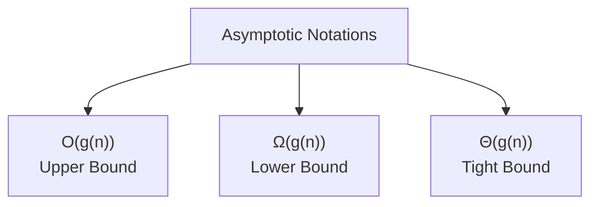

### Explanation

**Big-O** gives the maximum growth rate of an algorithm. If an algorithm is `O(n^2)`, its time will not grow faster than `n^2` after a certain point.

**Omega** gives the minimum growth rate. It tells the best possible performance.

**Theta** gives both upper and lower bound. If an algorithm is `Θ(n log n)`, then its growth rate is exactly proportional to `n log n`.

### Example

For linear search:

- Best case: element found at first position = **Ω(1)**
- Worst case: element found at last/not found = **O(n)**
- Average case = **Θ(n)**

### Common Growth Order

```text
O(1) < O(log n) < O(n) < O(n log n) < O(n^2) < O(2^n) < O(n!)
```

### Conclusion

Asymptotic notation is important because it helps analyze and compare algorithms by their efficiency.

---

## Q2. Explain time complexity and space complexity of an algorithm.

### Answer

**Time complexity** is the amount of time taken by an algorithm as a function of input size `n`. **Space complexity** is the amount of memory required by an algorithm.

### Types of Time Complexity

| Case | Meaning |
|---|---|
| **Best case** | Minimum time taken |
| **Average case** | Expected time for normal inputs |
| **Worst case** | Maximum time taken |

### Example

Linear search:

```text
Algorithm LinearSearch(A, n, key)
for i = 0 to n-1
    if A[i] == key
        return i
return -1
```

### Complexity

| Case | Time |
|---|---|
| Best case | **O(1)** |
| Worst case | **O(n)** |
| Average case | **O(n)** |

### Space Complexity

Linear search uses only a few variables, so space complexity is **O(1)**.

### Conclusion

Time complexity measures speed, while space complexity measures memory usage. Both are essential for algorithm analysis.

---

## Q3. Explain Master theorem and solve recurrence.

### Answer

**Master theorem** is used to solve recurrence relations of divide and conquer algorithms. It applies to recurrences of the form:

```text
T(n) = aT(n/b) + f(n)
```

Where:

- `a` = number of subproblems
- `n/b` = size of each subproblem
- `f(n)` = cost of dividing and combining

### Cases

| Case | Condition | Result |
|---|---|---|
| Case 1 | f(n) = O(n^(log_b a - ε)) | T(n) = Θ(n^(log_b a)) |
| Case 2 | f(n) = Θ(n^(log_b a)) | T(n) = Θ(n^(log_b a) log n) |
| Case 3 | f(n) = Ω(n^(log_b a + ε)) | T(n) = Θ(f(n)) |

### Example

Solve:

```text
T(n) = 2T(n/2) + n
```

Here:

- `a = 2`
- `b = 2`
- `f(n) = n`
- `n^(log_b a) = n^(log_2 2) = n`

Since `f(n) = Θ(n)`, it is **Case 2**.

Therefore:

```text
T(n) = Θ(n log n)
```

### Conclusion

Master theorem quickly solves divide and conquer recurrences like merge sort, binary search, and many recursive algorithms.

---

## Q4. Explain divide and conquer technique with merge sort.

### Answer

**Divide and conquer** is an algorithm design technique that divides a problem into smaller subproblems, solves them recursively, and combines their results.

### Steps

1. **Divide** the problem into smaller subproblems.
2. **Conquer** each subproblem recursively.
3. **Combine** the solutions.

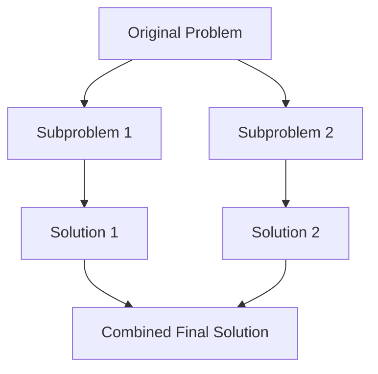

### Merge Sort Algorithm

```text
MergeSort(A, low, high)
if low < high
    mid = (low + high) / 2
    MergeSort(A, low, mid)
    MergeSort(A, mid + 1, high)
    Merge(A, low, mid, high)
```

### Example

```text
[8, 3, 5, 1]
Divide: [8, 3] [5, 1]
Divide: [8] [3] [5] [1]
Merge: [3, 8] [1, 5]
Merge: [1, 3, 5, 8]
```

### Complexity

| Case | Time |
|---|---|
| Best | **O(n log n)** |
| Average | **O(n log n)** |
| Worst | **O(n log n)** |
| Space | **O(n)** |

### Conclusion

Merge sort is a classic divide and conquer algorithm with stable and predictable `O(n log n)` performance.

---

# Unit II - Greedy Algorithms

## Q5. Explain greedy method with activity selection problem.

### Answer

**Greedy method** builds a solution step by step by choosing the option that looks best at the current moment. It does not reconsider previous choices.

### Greedy Strategy

For activity selection, choose the activity with the **earliest finishing time** so that maximum activities can be selected.

### Algorithm

```text
ActivitySelection(start[], finish[], n)
sort activities by finish time
select first activity
last = first activity
for i = 2 to n
    if start[i] >= finish[last]
        select activity i
        last = i
```

### Example

| Activity | Start | Finish |
|---|---:|---:|
| A1 | 1 | 2 |
| A2 | 3 | 4 |
| A3 | 0 | 6 |
| A4 | 5 | 7 |
| A5 | 8 | 9 |

Selected activities: **A1, A2, A4, A5**

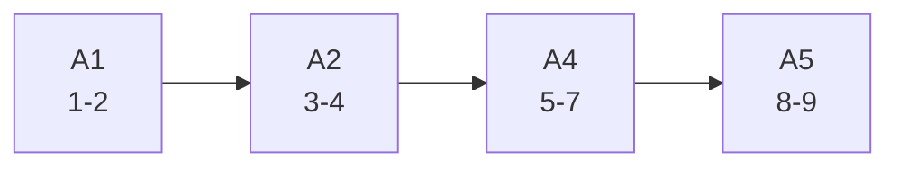

### Complexity

- Sorting: **O(n log n)**
- Selection after sorting: **O(n)**

### Conclusion

Activity selection is solved efficiently using greedy method because choosing earliest finishing activity gives optimal result.

---

## Q6. Explain fractional knapsack problem using greedy method.

### Answer

In **fractional knapsack**, items can be divided into fractions. The goal is to maximize profit within given knapsack capacity.

### Greedy Strategy

Choose items according to maximum **profit/weight ratio**.

### Algorithm

```text
FractionalKnapsack(items, capacity)
calculate ratio = profit / weight
sort items by ratio in descending order
for each item
    if item weight <= capacity
        take full item
    else
        take fraction of item
        break
```

### Example

| Item | Profit | Weight | Ratio |
|---|---:|---:|---:|
| I1 | 60 | 10 | 6 |
| I2 | 100 | 20 | 5 |
| I3 | 120 | 30 | 4 |

Capacity = 50

Take I1 + I2 + 20/30 of I3:

```text
Profit = 60 + 100 + (20/30)*120 = 240
```

### Complexity

- Sorting items: **O(n log n)**
- Selection: **O(n)**

### Conclusion

Fractional knapsack can be optimally solved by greedy method because fractions are allowed.

---

## Q7. Explain Prim's and Kruskal's algorithms for minimum spanning tree.

### Answer

A **minimum spanning tree (MST)** of a connected weighted graph is a spanning tree with minimum total edge weight.

### Prim's Algorithm

Prim's algorithm starts from any vertex and repeatedly adds the minimum weight edge that connects the tree to a new vertex.

```text
Prim(G)
select any start vertex
while all vertices not included
    choose minimum edge connecting tree to outside vertex
    add that edge
```

### Kruskal's Algorithm

Kruskal's algorithm sorts all edges by weight and adds edges one by one if they do not form a cycle.

```text
Kruskal(G)
sort all edges by weight
for each edge in sorted order
    if edge does not form cycle
        add edge to MST
```

### Diagram

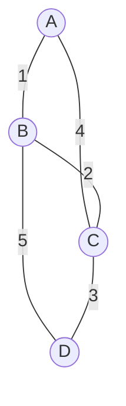

### Difference

| Basis | Prim's | Kruskal's |
|---|---|---|
| Approach | Vertex-based | Edge-based |
| Start | Starts with a vertex | Starts with smallest edge |
| Cycle check | Not required explicitly | Required |
| Best for | Dense graph | Sparse graph |

### Complexity

- Prim using priority queue: **O(E log V)**
- Kruskal using union-find: **O(E log E)**

### Conclusion

Both Prim's and Kruskal's algorithms use greedy method to find MST.

---

## Q8. Explain Dijkstra's shortest path algorithm.

### Answer

**Dijkstra's algorithm** finds the shortest path from a single source vertex to all other vertices in a weighted graph with **non-negative edge weights**.

### Algorithm

```text
Dijkstra(G, source)
set distance[source] = 0
set all other distances = infinity
while unvisited vertices exist
    choose vertex u with minimum distance
    mark u as visited
    for each neighbor v of u
        if distance[u] + weight(u,v) < distance[v]
            distance[v] = distance[u] + weight(u,v)
```

### Diagram

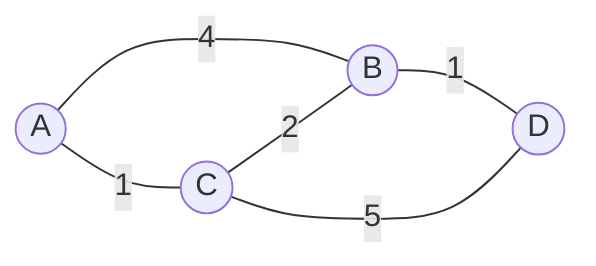

From A:

- A to C = 1
- A to B = 3 through C
- A to D = 4 through C -> B

### Complexity

| Implementation | Time |
|---|---|
| Array | **O(V^2)** |
| Priority queue | **O(E log V)** |

### Limitation

Dijkstra's algorithm does not work correctly with **negative edge weights**.

### Conclusion

Dijkstra's algorithm is an efficient greedy algorithm for single-source shortest path problems.

---

# Unit III - Dynamic Programming

## Q9. Explain dynamic programming with 0/1 knapsack problem.

### Answer

**Dynamic programming (DP)** is an algorithm design technique used when a problem has **overlapping subproblems** and **optimal substructure**.

In **0/1 knapsack**, each item can either be taken completely or not taken at all.

### DP Recurrence

Let `dp[i][w]` be maximum profit using first `i` items with capacity `w`.

```text
if weight[i] <= w:
    dp[i][w] = max(profit[i] + dp[i-1][w-weight[i]], dp[i-1][w])
else:
    dp[i][w] = dp[i-1][w]
```

### Algorithm

```text
Knapsack(W, wt[], profit[], n)
for i = 0 to n
    for w = 0 to W
        if i == 0 or w == 0
            dp[i][w] = 0
        else if wt[i] <= w
            dp[i][w] = max(profit[i] + dp[i-1][w-wt[i]], dp[i-1][w])
        else
            dp[i][w] = dp[i-1][w]
```

### Difference From Fractional Knapsack

| 0/1 Knapsack           | Fractional Knapsack |
| ---------------------- | ------------------- |
| Item cannot be divided | Item can be divided |
| Solved using DP        | Solved using greedy |
| More restrictive       | More flexible       |

### Complexity

- Time: **O(nW)**
- Space: **O(nW)**

### Conclusion

0/1 knapsack is solved using dynamic programming because greedy choice does not always give optimal result.

---

## Q10. Explain matrix chain multiplication.

### Answer

**Matrix chain multiplication** is a dynamic programming problem used to find the most efficient way to multiply a sequence of matrices. The order of multiplication affects the number of scalar multiplications.

### Important Point

Matrix multiplication is **associative**:

```text
(A x B) x C = A x (B x C)
```

But the cost may be different.

### Recurrence

Let `m[i][j]` be minimum multiplication cost from matrix `Ai` to `Aj`.

```text
m[i][j] = min(m[i][k] + m[k+1][j] + p[i-1] * p[k] * p[j])
```

### DP Structure

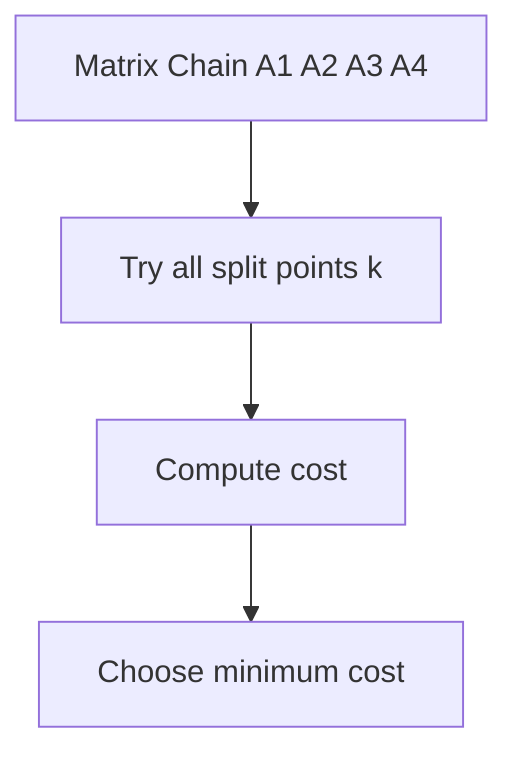

### Algorithm

```text
MatrixChain(p, n)
for i = 1 to n
    m[i][i] = 0
for length = 2 to n
    for i = 1 to n-length+1
        j = i + length - 1
        m[i][j] = infinity
        for k = i to j-1
            cost = m[i][k] + m[k+1][j] + p[i-1]*p[k]*p[j]
            m[i][j] = min(m[i][j], cost)
```

### Complexity

- Time: **O(n^3)**
- Space: **O(n^2)**

### Conclusion

Matrix chain multiplication is a classic DP problem that reduces multiplication cost by finding the best parenthesization.

---

## Q11. Explain longest common subsequence using dynamic programming.

### Answer

**Longest Common Subsequence (LCS)** is the longest sequence that appears in the same relative order in two strings, but not necessarily continuously.

Example:

```text
X = ABCDGH
Y = AEDFHR
LCS = ADH
```

### Recurrence

If characters match:

```text
L[i][j] = 1 + L[i-1][j-1]
```

If characters do not match:

```text
L[i][j] = max(L[i-1][j], L[i][j-1])
```

### Algorithm

```text
LCS(X, Y, m, n)
for i = 0 to m
    for j = 0 to n
        if i == 0 or j == 0
            L[i][j] = 0
        else if X[i-1] == Y[j-1]
            L[i][j] = 1 + L[i-1][j-1]
        else
            L[i][j] = max(L[i-1][j], L[i][j-1])
```

### Complexity

- Time: **O(mn)**
- Space: **O(mn)**

### Applications

- File comparison.
- DNA sequence matching.
- Version control systems.

### Conclusion

LCS is solved using dynamic programming because it has overlapping subproblems and optimal substructure.

---

## Q12. Explain Floyd-Warshall algorithm.

### Answer

**Floyd-Warshall algorithm** is a dynamic programming algorithm used to find shortest paths between all pairs of vertices in a weighted graph.

### Recurrence

```text
dist[i][j] = min(dist[i][j], dist[i][k] + dist[k][j])
```

### Algorithm

```text
FloydWarshall(dist, V)
for k = 1 to V
    for i = 1 to V
        for j = 1 to V
            if dist[i][k] + dist[k][j] < dist[i][j]
                dist[i][j] = dist[i][k] + dist[k][j]
```

### Diagram

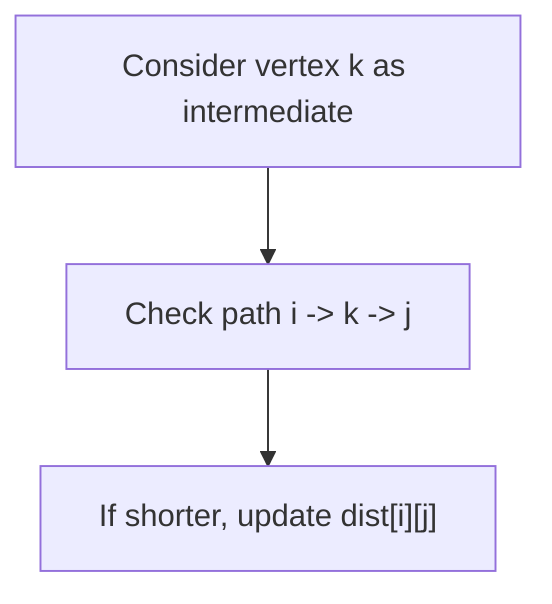

### Complexity

- Time: **O(V^3)**
- Space: **O(V^2)**

### Conclusion

Floyd-Warshall is useful for all-pairs shortest path and can handle negative edges, but not negative cycles.

---

# Unit IV - Backtracking and Branch & Bound

## Q13. Explain backtracking with N-Queen problem.

### Answer

**Backtracking** is an algorithmic technique that builds a solution step by step and removes a choice if it cannot lead to a valid solution.

### N-Queen Problem

Place `N` queens on an `N x N` chessboard so that no two queens attack each other.

Two queens attack if they are in the same:

- Row
- Column
- Diagonal

### Backtracking Idea

```text
Place queen in a row
Check if position is safe
If safe, move to next row
If no safe position, backtrack
```

### Diagram

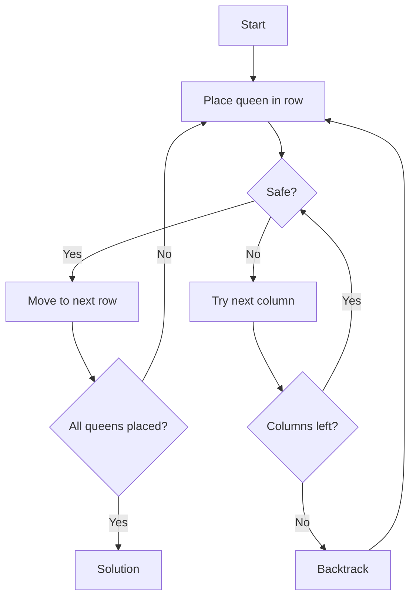

### Algorithm

```text
NQueen(row)
if row == N
    print solution
for col = 0 to N-1
    if isSafe(row, col)
        place queen
        NQueen(row + 1)
        remove queen
```

### Complexity

Worst-case time complexity: **O(N!)**

### Conclusion

N-Queen is a classic backtracking problem because invalid partial solutions are rejected early.

---

## Q14. Explain graph coloring problem using backtracking.

### Answer

**Graph coloring** is the problem of assigning colors to vertices of a graph such that no two adjacent vertices have the same color.

### Applications

- Exam scheduling.
- Map coloring.
- Register allocation.

### Algorithm

```text
GraphColoring(vertex)
if all vertices are colored
    print solution
for color = 1 to m
    if color is safe for vertex
        assign color
        GraphColoring(vertex + 1)
        remove color
```

### Diagram

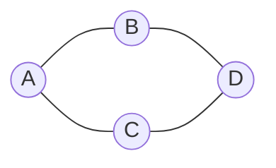

### Safe Condition

A color is safe if none of the adjacent vertices has the same color.

### Complexity

Worst-case time complexity: **O(m^V)**  
Where `m` is number of colors and `V` is number of vertices.

### Conclusion

Graph coloring is solved using backtracking by trying possible colors and rejecting invalid choices.

---

## Q15. Explain branch and bound technique.

### Answer

**Branch and bound** is an algorithm design technique used for optimization problems. It explores the solution space like backtracking but uses a **bound** to eliminate non-promising solutions.

### Main Terms

| Term | Meaning |
|---|---|
| **Branch** | Divide problem into subproblems |
| **Bound** | Estimate best possible solution from a node |
| **Pruning** | Remove non-promising nodes |
| **Live node** | Node that may be explored |
| **Dead node** | Node that will not be explored |

### Diagram

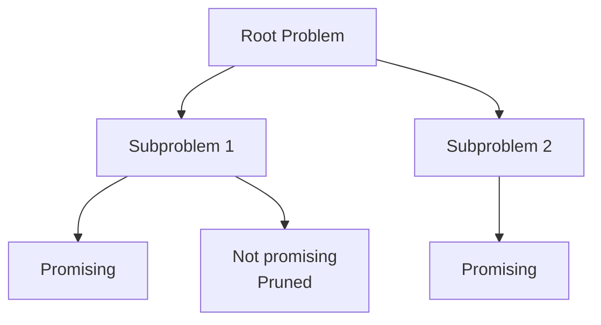

### Difference Between Backtracking and Branch & Bound

| Backtracking | Branch and Bound |
|---|---|
| Used for decision problems | Used for optimization problems |
| Checks feasibility | Checks optimality using bound |
| DFS is common | BFS/least-cost search is common |
| Example: N-Queen | Example: TSP, 0/1 knapsack |

### Conclusion

Branch and bound improves efficiency by avoiding unnecessary exploration of solutions that cannot give optimal answer.

---

# Unit V - NP Completeness and String Matching

## Q16. Explain P, NP, NP-hard and NP-complete problems.

### Answer

Problems in algorithm theory are classified based on how difficult they are to solve and verify.

### Definitions

| Class | Meaning |
|---|---|
| **P** | Problems solvable in polynomial time |
| **NP** | Problems whose solution can be verified in polynomial time |
| **NP-hard** | At least as hard as every problem in NP |
| **NP-complete** | Problems that are both NP and NP-hard |

### Diagram

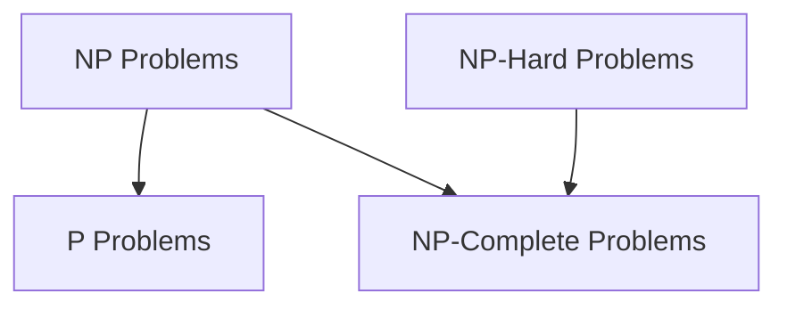

### Examples

| Class | Example |
|---|---|
| P | Binary search, shortest path |
| NP | Sudoku solution verification |
| NP-complete | SAT, Hamiltonian cycle, clique |
| NP-hard | Traveling salesman optimization problem |

### Important Points

- Every **P** problem is also in **NP**.
- If any NP-complete problem is solved in polynomial time, then **P = NP**.
- It is still unknown whether **P = NP**.

### Conclusion

P, NP, NP-hard, and NP-complete classifications help understand the difficulty of computational problems.

---

## Q17. Explain Naive string matching and KMP algorithm.

### Answer

String matching is used to find occurrences of a pattern `P` in a text `T`.

### Naive String Matching

Naive algorithm checks the pattern at every possible position in the text.

```text
NaiveStringMatch(T, P)
for s = 0 to n-m
    if P[0..m-1] == T[s..s+m-1]
        print s
```

### Complexity

- Worst case: **O(nm)**

### KMP Algorithm

**KMP (Knuth-Morris-Pratt)** improves string matching by avoiding repeated comparisons. It uses the **LPS array**.

**LPS** means longest proper prefix which is also suffix.

### KMP Steps

1. Preprocess pattern and build LPS array.
2. Compare text and pattern.
3. On mismatch, shift pattern using LPS instead of moving one by one.

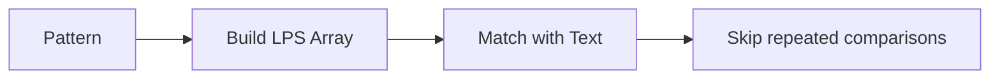

### Complexity

| Algorithm | Time |
|---|---|
| Naive | **O(nm)** |
| KMP | **O(n + m)** |

### Conclusion

KMP is more efficient than naive string matching because it uses the LPS array to skip unnecessary comparisons.

---

# Final 70+ Marks Strategy

## Must Write in Every Algorithm Answer

- **Algorithm name**
- **Approach**: greedy / DP / divide and conquer / backtracking
- **Pseudocode**
- **Example**
- **Time complexity**
- **Conclusion**

## Super Important Complexity Table

| Algorithm | Technique | Time Complexity |
|---|---|---|
| Binary Search | Divide and conquer | **O(log n)** |
| Merge Sort | Divide and conquer | **O(n log n)** |
| Quick Sort | Divide and conquer | Average **O(n log n)**, worst **O(n²)** |
| Activity Selection | Greedy | **O(n log n)** |
| Fractional Knapsack | Greedy | **O(n log n)** |
| Kruskal | Greedy | **O(E log E)** |
| Prim | Greedy | **O(E log V)** |
| Dijkstra | Greedy | **O(E log V)** |
| 0/1 Knapsack | DP | **O(nW)** |
| Matrix Chain | DP | **O(n³)** |
| LCS | DP | **O(mn)** |
| Floyd-Warshall | DP | **O(V³)** |
| N-Queen | Backtracking | **O(N!)** |
| Graph Coloring | Backtracking | **O(m^V)** |
| Naive String Match | String matching | **O(nm)** |
| KMP | String matching | **O(n+m)** |

